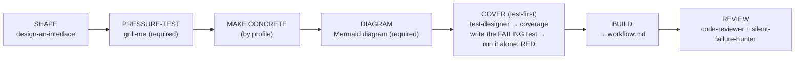

# Design Workflow (the _how_ of GATE 1)

Last updated: 2026-08-10 01:49

> **Source of truth & sync.** Repo snapshot of the machine-global `~/.claude/rules/design-workflow.md`
> (via `sync-rules.sh`). `docs/DESIGN-WORKFLOW.md` is the expanded shipped companion (same spine + a
> by-profile MAKE-CONCRETE table). Keep the two reconciled in substance — this file stays compact, the
> doc carries the tables. There is no auto-sync between them; edit both.

The Design leg of **Design → Code → Prove** (`workflow.md`). This is _how_ you satisfy
GATE 1 — turn intent into a concrete, approved design before any implementation. A
`CLAUDE.md` instruction still wins, and the gate is never skipped. A design is **approved**
when shape + tokens + key states are concrete enough to build without guessing — then
`workflow.md` BUILD → VERIFY takes over. Run the stages that fit; skip what doesn't.

A design is **approved** when it's concrete enough to build without guessing — for UI that's
rendered pixels + tokens + states; for a service it's the **API contract**; for a CLI/library the
**public interface**; for data the **schema/contract**. The sharpest, executable form of that bar is
**you can write a RED test against the contract** (the COVER step below); if you can't, it isn't
concrete enough yet.

## The design pipeline (universal spine)

- **SHAPE** — `design-an-interface` ("Design It Twice": 3+ radically different designs, compared on simplicity/depth/misuse-resistance) → the chosen interface shape. Strongest fit for CLI/library/API work, where the interface _is_ the deliverable.
- **PRESSURE-TEST** *(required — never skip)* — `grill-me` → severity-tiered flaws surfaced. **Fold
  every finding back into the plan/design doc before moving on** — a flaw noted in the grill-me transcript
  but never incorporated into the actual design didn't happen; the doc, not the conversation, is what SHAPE
  hands to BUILD. Fixed _before_ you commit to a direction.
- **MAKE CONCRETE** *(by profile)* — **Web UI** → the rendered-design sub-pipeline below (art-direct · visual/tokens · polish); **Service/API** → OpenAPI/schema + example request/response pairs; **CLI/Library** → signatures, flags, exit codes, error types (a `--help` sketch); **Data** → input/output schema + sample-in→sample-out fixtures.
- **DIAGRAM** *(required)* — the design must include a **Mermaid diagram** of the approach (flow / state
  machine / architecture / interface) in the design doc/spec. It's picked up at CLOSE when `/workflow-diagrams`
  refreshes the project's diagram page. (Convention in the rule; a real guard is TBD — #118.)
- **COVER (test-first)** *(the executable proof the design is buildable)* — **(1) coverage** — `test-designer` maps the contract's behaviours/state-transitions → a coverage doc (Mermaid for stateful flows, checklist table otherwise); advisory, no test code. **(2) failing test** — write the behaviour test(s) (Web → `e2e/*.spec.ts`; API → integration test on the contract; CLI/lib → golden/signature test; data → fixture), then **run JUST that new test** (`cc-worktrees test -- <only this test>`) to confirm it fails RED for the right reason (assertion / 404 / not-implemented — not a syntax error). Run ONLY the new test: the rest of the suite stays green, only this one is red. ⚠ Do NOT run `/validate` here — that's the full-suite GREEN gate at VERIFY/P4. The red test hands to BUILD so BUILD is genuinely red→green.
- **BUILD** — domain skills (web: `frontend-design`) → production code that turns the COVER red test green. _(Hand-off: `workflow.md` BUILD → VERIFY ⛔ now owns it.)_
- **REVIEW** — the panel: **required** `code-reviewer` (= `/code-review` — run one, not both) + `silent-failure-hunter`; **recommended** `code-simplifier` + `comment-analyzer`; `/security-review` (distinct); web also `web-design-guidelines`. **If the panel changes code, re-run VERIFY before merge.**

---

### Web-UI profile only — art direction, visual & tokens

> _Web UI only._ Service/API, CLI/library, and data projects satisfy GATE 1 at "MAKE CONCRETE"
> (a contract / interface / schema) and skip to BUILD — there are no pixels to approve.

- **ART-DIRECT** _(premium/brand sites only)_ — `award-winning-web-design` → a `concept.md` with real tokens + motion specs. Internal tools skip this.
- **SOURCE A LOOK / TOKENS** _(optional)_ — `design-import` (lift an existing site → tokenized HTML + React + `IMPORT.md`), **or** port a claude.ai/design / Figma-Make export, **or** pull tokens from Figma (table below).
- **POLISH** — `ui-aliveness-audit` → micro-feedback, loading/empty states, motion. **Every animation reduced-motion-gated.**

> **GATE-1 approves a RENDERED design, not a MECHANISM.** "Build frame 2:4 / mirror `DossierCard`" is a
> _build instruction_, not an approved look — building straight from it produces "that's not the design"
> reversals. Render the design to a **dev-only gated preview** (e.g. `/design-preview/<name>`),
> **screenshot desktop + mobile**, and get explicit human sign-off on _those pixels_ **before** wiring real
> routes/data. _(The analogue for an API is "approve the contract, not the handler"; for a CLI, "approve
> the `--help`, not the parser".)_

#### Figma / Claude Design — quota-free first

**Never spend the Figma MCP quota (≈6 calls/month on Starter) on iteration — only on the final, approved design.** Ranked free → paid:

| Path                                                                                                   | Cost      | Fidelity                  | Use when                                                                                   |
| ------------------------------------------------------------------------------------------------------ | --------- | ------------------------- | ------------------------------------------------------------------------------------------ |
| **Port a Claude Design / Figma-Make export** (`DesignSync get_file` the React export → serve → render) | **0**     | exact (it _is_ code)      | the design already exists as code — the most faithful path                                 |
| **`window.figma` browser API** (`mcp__claude-in-chrome__javascript_tool`, logged-in tab)               | **0**     | exact (native plugin API) | iterating in Figma — bypasses the 6/month quota **and** the 3-page cap, unlimited          |
| **Chrome DevTools MCP / Playwright** (own browser, `http://127.0.0.1:PORT`)                            | **0**     | exact render              | screenshotting the live app — immune to the blocked extension (`local-browser-testing.md`) |
| **`html.to.design`** plugin (incl. localhost extension)                                                | **0**     | ~70-80%                   | bootstrap a running site → editable Figma layers for review                                |
| **Figma MCP `get_design_context` / `get_variable_defs`**                                               | **quota** | 95%+ semantic             | one-shot codegen / token-sync from the FINAL design (unlimited on a Dev seat)              |

Direction: `get_design_context` reads **Figma → code**; `use_figma` / `figma-generate-design` go **code → Figma**. Don't confuse them. `/design-sync` _pushes_ a repo design system **into** claude.ai/design (separate from reading a project via `DesignSync`).

**Project file + channel (cc-worktrees wiring):** one project = one Figma file (named after the repo
folder; key in `FIGMA_FILE_KEY` in `.claude/worktrees.conf`) = one stable talk-to-figma channel
(`$FIGMA_CHANNEL` = folder name, exported in every pane; the patched plugin persists it — typed once,
never a random id). At NEW-project bootstrap: create the file via the Figma MCP `create_new_file`
(named after the folder), write its key + `FIGMA_LAUNCH=1` into `.claude/worktrees.conf`.

> **The _how_ of this leg → `FIGMA-UI.md`.** When VISUAL/TOKENS means driving Figma — the two-bridge
> split (free arinspunk bridge vs. the metered official MCP), **Code Connect** (the highest-value lever
> to try first), the parallel-crew constraints, and the reverse **code → Figma mirror** (token sync and
> the A/B/C scripts) — `FIGMA-UI.md` is the playbook; `figma-ui.md` the per-change checklist.

## See also

`FIGMA-UI.md` (Figma-MCP mechanics of VISUAL/TOKENS → BUILD) · `figma-ui.md` (per-change checklist) · `agent-delegation.md` (delegate the parallel design exploration to subagents) · `local-browser-testing.md` (`127.0.0.1`, never the blocked Claude-in-Chrome extension).
