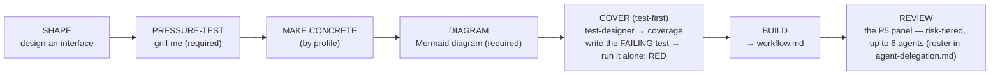

# Design Workflow (the _how_ of GATE 1)

Last updated: 2026-10-05 13:22

The Design leg of **Design → Code → Prove** (`workflow.md`). This is _how_ you satisfy
GATE 1 — turn intent into a concrete, approved design before any implementation. A
`CLAUDE.md` instruction still wins, and the gate is never skipped. A design is **approved**
when shape + tokens + key states are concrete enough to build without guessing — then
`workflow.md` BUILD → VERIFY takes over. Run the stages that fit; skip what doesn't.

A design is **approved** when it's concrete enough to build without guessing — for UI that's
rendered pixels + tokens + states; for a service it's the **API contract**; for a CLI/library the
**public interface**; for data the **schema/contract**; for meta/tooling (a hook/script) the
**trigger + input + exit-code/effect contract**. The sharpest, executable form of that bar is
**you can write a RED test against the contract** (the COVER step below); if you can't, it isn't
concrete enough yet.

## The design pipeline (universal spine)

```mermaid
flowchart LR
    S["SHAPE<br/>design-an-interface"] --> G["PRESSURE-TEST<br/>grill-me (required)"]
    G --> M["MAKE CONCRETE<br/>(by profile)"]
    M --> D["DIAGRAM<br/>Mermaid diagram (required)"]
    D --> C["COVER (test-first)<br/>test-designer → coverage<br/>write the FAILING test → run it alone: RED"]
    C --> B["BUILD<br/>→ workflow.md"]
    B --> R["REVIEW<br/>the P5 panel — risk-tiered, up to 6 agents (roster in agent-delegation.md)"]
```

- **SHAPE** — `design-an-interface` ("Design It Twice": 3+ radically different designs, compared on simplicity/depth/generality/misuse-resistance) → the chosen interface shape. Strongest fit for CLI/library/API work, where the interface _is_ the deliverable.
- **PRESSURE-TEST** *(required — never skip)* — `grill-me` → severity-tiered flaws surfaced. **Fold
  every finding back into the plan/design doc before moving on** — a flaw noted in the grill-me transcript
  but never incorporated into the actual design didn't happen; the doc, not the conversation, is what SHAPE
  hands to BUILD. Fixed _before_ you commit to a direction. **Grill your own proposed solution against
  live state too** — probe each mechanism your fix introduces and tag it `[EXISTS]`/`[IMPOSSIBLE]`/
  `[NEEDED]` (canonical in `workflow.md` Adherence #5.1); an already-shipped or structurally-impossible
  mechanism never reaches BUILD. **This is the FIRST of two mandatory grills**
  (`workflow.md` Adherence #5): grill the DESIGN here, then grill the PLAN again after `writing-plans`
  emits it (its step sequencing, interfaces, failure modes) — recorded in the plan's own
  `## Grill findings`. The `grill_gate` hook blocks committing either a spec or a `docs/superpowers/plans/**`
  plan whose `## Grill findings` is missing/empty.
- **MAKE CONCRETE** *(by profile)* — **Web UI** → the rendered-design sub-pipeline below (art-direct · visual/tokens · polish); **Service/API** → OpenAPI/schema + example request/response pairs; **CLI/Library** → signatures, flags, exit codes, error types (a `--help` sketch); **Data** → input/output schema + sample-in→sample-out fixtures; **Meta/tooling** → the hook/script interface: trigger event, inputs, exit codes, and the ALLOW/DENY (or side-effect) it produces.
- **DIAGRAM** *(required)* — the design must include a **Mermaid diagram** of the approach (flow / state
  machine / architecture / interface) in the design doc/spec. It's picked up at CLOSE when `/workflow-diagrams`
  refreshes the project's diagram page. (Convention in the rule; a real guard is TBD.)
- **COVER (test-first)** *(the executable proof the design is buildable)* — **(1) coverage** — `test-designer` maps the contract's behaviours/state-transitions → a coverage doc (Mermaid for stateful flows, checklist table otherwise); advisory, no test code. **(2) failing test** — write the behaviour test(s) (Web → `e2e/*.spec.ts`; API → integration test on the contract; CLI/lib → golden/signature test; data → fixture), then **run JUST that new test** (`bin/test-lock -- <only this test>`) to confirm it fails RED for the right reason (assertion / 404 / not-implemented — not a syntax error). Run ONLY the new test: the rest of the suite stays green, only this one is red. ⚠ Do NOT run `/validate` here — that's the full-suite GREEN gate at VERIFY/P4. The red test hands to BUILD so BUILD is genuinely red→green. **Binary, and BEFORE the plan.** Each acceptance test is a **1/0 pass/fail** against the contract, and it is authored + confirmed RED at the *start* of P2 — **before `writing-plans` emits the implementation plan** — so the plan is written against a concrete pass/fail target, not the reverse. A plan with no associated binary acceptance test isn't buildable yet; the plan doc should name the test (path or id).
- **BUILD** — domain skills (web: `frontend-design`) → production code that turns the COVER red test green. _(Hand-off: `workflow.md` BUILD → VERIFY ⛔ now owns it.)_
- **REVIEW** — the panel, **risk-tiered** by `/pr-open` via `claude-template pr-tier` (tier 0 docs-only → `code-reviewer` only; tier 1 → code + security + test-quality + docs-impact-agent, or the prose prompt-code sub-case → code + security + docs-impact-agent with test-quality `WAIVED reason=no-testable-behavior`; tier 2 → the full roster below + docs-impact-agent; `--full` forces tier 2), dispatched only via `/pr-open` **CONCURRENTLY in one message** — the full roster, the per-agent verdicts, and the `pr_gate` marker/bypass rules live in **`agent-delegation.md`** (the auditor role): required `code-reviewer` (= `/code-review`) + `silent-failure-hunter` + `security-reviewer` + `test-quality-reviewer`; advisory `code-simplifier` + `comment-analyzer`. Design-specific additions here: `/security-review` (the deeper skill pass) and, for web, `web-design-guidelines`. **If the panel changes code, re-run VERIFY before merge.**

---

### Web-UI profile only — art direction, visual & tokens

> _Web UI only._ Service/API, CLI/library, data, and meta/tooling projects satisfy GATE 1 at "MAKE
> CONCRETE" (a contract / interface / schema) and skip to BUILD — there are no pixels to approve.

- **ART-DIRECT** _(premium/brand sites only)_ — `award-winning-web-design` → a `concept.md` with real tokens + motion specs. Internal tools skip this.
- **SOURCE A LOOK / TOKENS** _(optional)_ — `design-import` (lift an existing site → tokenized HTML + React + `IMPORT.md`), **or** port a claude.ai/design / Figma-Make export, **or** pull tokens from Figma (table below).
- **POLISH** — `ui-aliveness-audit` → micro-feedback, loading/empty states, motion. **Every animation reduced-motion-gated.**

> **GATE-1 approves a RENDERED design, not a MECHANISM.** "Build frame 2:4 / mirror `DossierCard`" is a
> _build instruction_, not an approved look — building straight from it produces "that's not the design"
> reversals. Render the design to a **dev-only gated preview** (e.g. `/design-preview/<name>`),
> **screenshot desktop + mobile**, and get explicit human sign-off on _those pixels_ **before** wiring real
> routes/data. _(The analogue for an API is "approve the contract, not the handler"; for a CLI, "approve
> the `--help`, not the parser".)_

> **Codify the approved look as a visual-regression check.** Once a component's design is signed off,
> add it to the dev-only `visual-preview/[name]` gallery + `e2e/component-visual.spec.ts` (golden
> self-screenshots at desktop/tablet/mobile widths, Linux baselines generated in the pinned Playwright
> image). This catches visual drift automatically — the standing companion to the one-time pixel
> sign-off. (Scaffolded into new web projects by default, inert until you register a component.)

#### Figma / Claude Design — quota-free first

**Never spend the Figma MCP quota (≈6 calls/month on Starter) on iteration — only on the final, approved design.** Ranked free → paid:

| Path                                                                                                   | Cost      | Fidelity                  | Use when                                                                                   |
| ------------------------------------------------------------------------------------------------------ | --------- | ------------------------- | ------------------------------------------------------------------------------------------ |
| **Port a Claude Design / Figma-Make export** (`DesignSync get_file` the React export → serve → render) | **0**     | exact (it _is_ code)      | the design already exists as code — the most faithful path                                 |
| **`window.figma` browser API** (`mcp__claude-in-chrome__javascript_tool`, logged-in tab)               | **0**     | exact (native plugin API) | iterating in Figma — bypasses the 6/month quota **and** the 3-page cap, unlimited          |
| **Chrome DevTools MCP / Playwright** (own browser, `http://127.0.0.1:PORT`)                            | **0**     | exact render              | screenshotting the live app — immune to the blocked extension (the `local-browser-testing` plugin skill) |
| **`html.to.design`** plugin (incl. localhost extension)                                                | **0**     | ~70-80%                   | bootstrap a running site → editable Figma layers for review                                |
| **Figma MCP `get_design_context` / `get_variable_defs`**                                               | **quota** | 95%+ semantic             | one-shot codegen / token-sync from the FINAL design (unlimited on a Dev seat)              |

Direction: `get_design_context` reads **Figma → code**; `use_figma` / `figma-generate-design` go **code → Figma**. Don't confuse them. The design-sync push flow sends a repo design system **into** claude.ai/design (external claude.ai/design flow — no local slash command; separate from reading a project via `DesignSync`).

**Project file + channel:** one project = one Figma file (named after the repo
folder; key in `FIGMA_FILE_KEY` in `.claude/worktrees.conf`) = one stable DEFAULT talk-to-figma channel
(`$FIGMA_CHANNEL` = folder name; once opened the patched plugin auto-joins the open file's name — so name the Figma file exactly the folder basename — never a random id). The patched panel now hosts **multiple channels in one window** (default 5 rows named `<file>_1..5` + a "+" to add more): on launch **all 5 rows auto-connect** (row 1 adopts the open file's name as its base), each giving a parallel agent on the same file a ready channel; a dropped channel **auto-reconnects** with capped backoff (2s→30s) until it recovers or you Disconnect. At NEW-project bootstrap: create the file via the Figma MCP `create_new_file`
(named after the folder), write its key + `FIGMA_LAUNCH=1` into `.claude/worktrees.conf`.
`FIGMA_LAUNCH=1` is **consumed by the async `figma_launch` SessionStart hook** (macOS or Linux): on each
`startup` it opens Figma (the `FIGMA_FILE_KEY` file when set) and brings up the ClaudeTalkToFigma
bridge (fixed `:3055`) if it isn't already listening — so a design session starts
with the environment already up. On **macOS** it can also **auto-run the plugin** (`Cmd+P` →
`ClaudeTalkToFigma` → `Enter`), verify it joined the folder channel via the figma-bridge `probe`, and
screenshot the Figma window — gated by `FIGMA_AUTOLAUNCH_PLUGIN` (default on) and **inert until you
import the panel once + `touch ~/.local/share/claude-template/ctf-imported`** (needs Accessibility +
Screen Recording; the probe is the source of truth, keystrokes are capped). See the `figma_launch`
SessionStart hook.

> **The _how_ of this leg → `FIGMA-UI.md`.** When VISUAL/TOKENS means driving Figma — the two-bridge
> split (free arinspunk bridge vs. the metered official MCP), **Code Connect** (the highest-value lever
> to try first), the parallel-crew constraints, and the reverse **code → Figma mirror** (token sync and
> the A/B/C scripts) — `FIGMA-UI.md` is the playbook; the `figma-ui` skill the per-change checklist.

## Skill interview convention (the before/after-skill feedback lifecycle)

A skill that takes arguments (a choice-y `argument-hint`) should not fire blind — it runs an
**interview before** and a **questionnaire after**, so intent is pinned up front and open decisions are
captured at the end rather than guessed:

- **`## Interview` (BEFORE_SKILL).** An optional `## Interview` block in the `SKILL.md` — **≥4
  `AskUserQuestion` prompts, one at a time** — run at skill start to resolve the choice-y inputs before
  any action. The one-at-a-time cadence here is deliberate and is **not** in tension with
  `autonomy.md` A4's "batch the blockers in one ask": A4 governs unplanned blocker-questions (batch
  them), while this Interview is a designed sequential intake where each answer shapes the next. The `skill_nudge` PostToolUse hook WARNs when a choice-taking `SKILL.md` lacks this block
  (nudge only — a hook can't run the interview). Author it through `writing-skills` (never
  ad-hoc). This promotes `skill-audit`'s `askuserquestion` heuristic to a real convention.
- **`/to-questionnaire` (AFTER_SKILL).** After the skill finishes, run the mattpocock `to-questionnaire`
  skill (or `/questionnaire-me`) to turn any decision the skill surfaced-but-couldn't-resolve into an
  async Markdown questionnaire for the human — the AFTER_SKILL → POST_INTERVIEW leg.

`AskUserQuestion` is the in-session interview; `/to-questionnaire` is the async, someone-else-decides
follow-up. Lifecycle: **BEFORE_SKILL (interview) → SKILL_EXECUTION → AFTER_SKILL (`/to-questionnaire`)**.

For a skill *about a skill*, the AFTER_SKILL applier is **`/improve-skills`**: it consolidates
skill-improvement proposals from `skill-audit`, `skill-reinvent`, and `/dev-reflect` and drives each
human-approved change through `writing-skills` (never auto-applying). `/to-questionnaire`
captures an async human decision; `/improve-skills` lands an approved skill change — complementary
AFTER_SKILL legs.

## See also

`FIGMA-UI.md` (Figma-MCP mechanics of VISUAL/TOKENS → BUILD) · the `figma-ui` skill (per-change checklist) · `agent-delegation.md` (delegate the parallel design exploration to subagents) · the `local-browser-testing` plugin skill (`127.0.0.1`, never the blocked Claude-in-Chrome extension) · `/questionnaire-me` + mattpocock `to-questionnaire`/`grilling` (the interview/questionnaire primitives).
