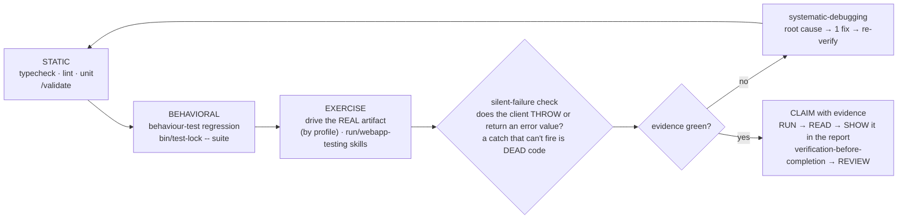

# Verify Workflow (the *how* of GATE 2)

Last updated: 2026-10-05 23:40

The Prove leg of **Design → Code → Prove** (`workflow.md`). This is *how* you satisfy
GATE 2 — earn the word "done" with FRESH evidence THIS turn. The discipline: **RUN it →
READ it → SHOW it.** No "should / probably / seems" — run the check, read the real output,
and surface the evidence to the user. A suite the same agent just wrote is not independent
proof, and green unit tests ≠ "works" (drive the running app too). `CLAUDE.md` wins; the
gate is never skipped.

## The verify pipeline (fast → slow; targeted while iterating, a tier-2 full suite per PR)

- **STATIC** *(seconds — fail fast)* — typecheck + lint + unit via `/validate` (or the project's command). Always-on, zero flakiness.
- **BEHAVIORAL** *(codified regression — a tier-2 full suite per PR)* — the behaviour-test suite for your stack (web: `e2e/*.spec.ts` via `playwright-tester`, `frontend-testing` for vitest; service: integration tests; CLI/lib: golden/property tests; data: fixture tests; meta/tooling: the repo's own suite, e.g. `bash tests/run.sh`). Hold the per-repo lock: `bin/test-lock --wait -- <cmd>` (queues FIFO behind a held lock instead of exiting 75 — never hand-roll a retry loop; the `test_lock_enforce` hook denies raw suite runs). **Test cadence — a tier-2 full suite per PR:** during BUILD and fix rounds run only the touched/*affected* test files — the slice the diff covers plus a fixed smoke floor (your runner's affected-selection mode if it has one, e.g. a `--affected` flag that prints what it picked and labels itself a subset — otherwise the touched test files); run a full suite per PR **only for a tier-2 PR** (logic / gated paths) — a single local run under `bin/test-lock` at the final synced head; a **tier-0/1 PR's per-PR gate is the affected slice plus the smoke floor**, no full run required; a contained fix-round delta covered by its own tests needs only a targeted re-run; a change to the test runner or to setup/install scripts, or a release / integration-train close, always gets a full run **regardless of tier** (an affected selector must fall back to the full suite on exactly those foundational changes).
- **EXERCISE** *(green ≠ works)* — start the artifact and drive the RUNNING thing (the `run`/`webapp-testing` skills — no slash command). _How_ depends on the profile: **Web UI** → browser @`http://127.0.0.1:PORT` with **Chrome DevTools MCP** (`webapp-testing`, never the blocked extension — the `local-browser-testing` plugin skill), screenshots; **Service/API** → hit endpoints (`curl`/HTTP client), assert status+body; **CLI/Library** → run it, assert stdout+exit code; **Data** → run on fixtures, assert output schema/row counts; **Meta/tooling** *(no runnable app — hooks/scripts/template)* → fire the changed unit (trigger the hook / invoke the script) on a real input and assert its effect, since there is no long-running artifact to drive. Codify anything you check by hand as a test.
- **THE FULL SUITE IS LOCAL, DELTA RE-REVIEW** *(spec `2026-10-03-less-rework-design.md` R3/R4; CI teardown `2026-10-05-ci-teardown.md`)* — there is no CI: a **tier-2** PR's one full suite is a single local full-suite run under `bin/test-lock`, at the final synced head (for a tier-2 PR, never a partial/affected subset standing in for it, and never an earlier head; a tier-0/1 PR gates on the affected slice instead). Review follows the same shape on a fix round: once `Open:` is `none`, `security-reviewer` and `test-quality-reviewer` re-review the delta diff and post a normal verdict at the new head, instead of the whole PR diff again — unless the delta touches a gated path, which still forces a full-diff re-run (`agent-delegation.md` has the gated-path list and the `pr-open.md` mechanics). Where CI is absent, this local full-suite-at-head requirement is now machine-asserted at the merge gate itself — a `suite:PASS@head` marker — not just a convention; `pr_gate` fails CLOSED without it, bypass `WORKFLOW:no-suite`.
- **LOCAL-STACK OWNERSHIP** *(before you conclude "data loss")* — every scaffolded project runs `supabase start` on the same default ports (54321/54322), so a sibling project can silently squat them and your app drives the *wrong, empty* DB — which reads as vanished data. Before believing it: `docker ps` for **who binds 54321/54322**, `docker ps -a` for your own db container's real state (`Created` / `Exited (137)` ≠ running); fix with `supabase stop && supabase start` (volumes preserved).
- **SILENT-FAILURE CHECK** — *best-effort ≠ unobservable.* For each `try/catch` around a client call, confirm the client actually *throws* on the failure mode — many (e.g. `supabase-js rpc()`) **return `{ error }` and do NOT throw**, so the `catch` is dead code and the error is silently dropped. Read the error and log a breadcrumb even when you intentionally continue. (Pairs with `silent-failure-hunter` at REVIEW.)
- **ON FAIL** — `systematic-debugging` (root cause → ONE hypothesis → failing test → single fix), then re-run the touched test files (a test-runner or setup-script change gets a full run). Don't patch symptoms; ≥3 failed fixes → question the architecture.
- **CLAIM** — only via `verification-before-completion`: the exact command + its real output, THIS turn, **and SHOW that evidence in your report** (a screenshot/response captured but never surfaced is half-wasted). GATE 2 passed → `workflow.md` REVIEW (`/code-review`, **distinct** from verify) takes over.
- **ADVERSARIAL RE-VERIFY** *(optional, after CLAIM)* — `/verify-adversarial` (the `claude-template` plugin command) attacks a finished change from the assumption its summary is WRONG: scope check (every touched file ↔ a requirement), cold suite re-run under `bin/test-lock`, false-test sweep (no-assert / mock-only / mocked-SUT / skipped / expectation-copied-from-output), mutation check (break the covered code, confirm the test goes RED, explicit-path restore), checkbox audit. Report-only — it never fixes. Strongest right before REVIEW/merge, or auditing another agent's "done".

## What counts as "fresh evidence" (the only thing GATE 2 accepts)

| ✅ evidence | ❌ not evidence |
|---|---|
| command run THIS turn + its real output (`1446 passed in 12.3s`, exit 0) | "I ran it earlier / it should pass / the code looks right" |
| the evidence **shown in the report** — a screenshot of the RUNNING app (web) · the real HTTP response (API) · stdout + exit code (CLI/lib) · output schema + row counts (data) | a test *description* with no run; mocked / asserted output; **evidence captured but never surfaced** |
| the failing test, now green after the fix | "all tests are green" with no command, count, or durations |

**Checklist before "done":** ran this turn · exit 0 · pass-count shown · nothing wrongly skipped/xfailed · no flaky/retry · real artifact driven (web→screenshot · API→response · CLI→stdout/exit · data→output) · **evidence SHOWN in the report** · **no dead `try/catch` swallowing a returned error** · a full suite per PR for a tier-2 PR at the final synced head (a local run under `bin/test-lock`) — tier-0/1 gates on the affected slice — and the affected test slice in between.

> **Exit 0 means "nothing that ran failed," NOT "everything passed."** Reconcile the count:
> `ran + skipped + didn't-run == total`. A green exit on a partial run hides the untested bucket —
> re-run any group you didn't explicitly select before claiming the whole suite is green.

## See also
`verification-before-completion` (RUN→READ→SHOW) · `systematic-debugging` (4-phase root cause) · `/validate` · the `run`/`webapp-testing` skills (drive the real artifact) · the `local-browser-testing` plugin skill (`127.0.0.1`, not the extension) · `agent-delegation.md` (delegate to playwright-tester / code-reviewer). Worked example — a 3-leg local gate with no CI: unit + lint, the e2e suite, and a live-app smoke, all green in-session before an admin-merge to `main`.
