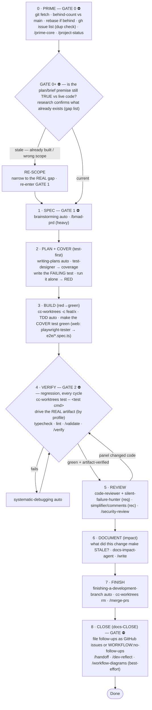
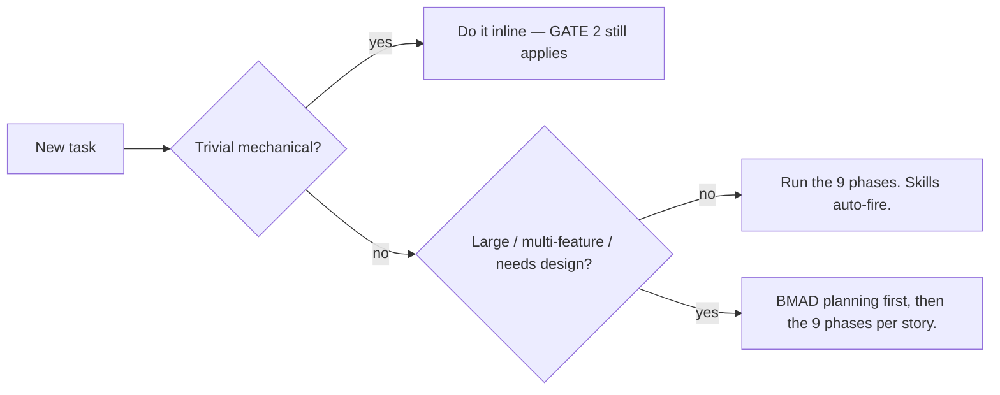

# Canonical Dev Workflow (every project, every session)

Last updated: 2026-08-10 01:49

> **THE LAW — Design → Code → Prove.** Shape it before you build it (GATE 1 ⛔), prove it
> with fresh evidence before you call it done (GATE 2 ⛔). Two hard gates, never skipped.
> The *how* of the Design and Prove legs lives in `design-workflow.md` / `verify-workflow.md`.

One workflow, everywhere — **any stack** (web · service/API · CLI/library · data). The discipline is
universal; only _how you drive the real artifact_ in VERIFY and _make the design concrete_ in GATE 1
change by profile (see `verify-workflow.md` / `design-workflow.md`). The **superpowers methodology is
the ambient engine** — its skills auto-fire as their preconditions match, so you rarely invoke them by
name. Don't fight the gates.

> **Source of truth & sync.** This file is the repo's versioned snapshot of the machine-global
> `~/.claude/rules/workflow.md` (synced via `sync-rules.sh capture`/`install`). The project-facing
> `docs/WORKFLOW.md` is the stamped copy. Keep the three reconciled in substance — esp. GATE 0 below.

Two laws override everything: a `CLAUDE.md` instruction beats any skill, and the **HARD GATES** are
never skipped.

- **GATE 0 — Baseline before anything.** No design/code until you've synced to the current source of
  truth THIS session: `git fetch`, check the behind-count vs `main` (`git rev-list --count HEAD..origin/main`),
  **rebase if behind**, and diff the live/deployed artifact — not a stale local snapshot. A worktree is a
  snapshot in time; build on a stale one and you redo work that already exists. **Verify the plan/brief
  premise too**, not just the git base — a plan/PRD is a snapshot as well, often staler than the branch.
  Have research characterize the target surface against live code and emit a tagged
  `[EXISTS]/[PARTIAL]/[MISSING]` + file:line gap list; if the target already exists, re-scope to the
  real gap and re-enter GATE 1 before building. A spawning plan is a hypothesis to falsify, not a contract.
- **GATE 1 — Design before code.** No implementation until an approved design exists
  (`brainstorming`; or, for big work, a BMAD PRD + architecture).
- **GATE 2 — Evidence before "done".** No "done/fixed/passing" claim without FRESH output THIS
  turn — unit tests, typecheck, lint, AND the behaviour tests run against the **real artifact**
  (`verification-before-completion` + `/validate` / `/verify`). **SHOW the evidence in your report** —
  surface what proves it (screenshot for UI · response body for API · stdout/exit for CLI · output
  rows for data); evidence the user can't see is half-wasted.

## The 9 phases

## Phase → tools

| # | Phase | Drives it (auto) | Commands / tools |
|---|-------|------------------|------------------|
| 0 | PRIME ⛔ | — | **sync baseline first** (`git fetch` · behind-count vs `main` · rebase if behind) · **verify the plan premise vs live code** (gap list) · `gh issue list` (already tracked? avoid dup work) · `/prime-core` · `/project-status` · context-map |
| 1 | SPEC ⛔ | `brainstorming` | **grill-me (required)** · a **Mermaid diagram** of the design (required) · `/bmad-prd` (heavy) · **see `design-workflow.md`** |
| 2 | PLAN + COVER (test-first) | `writing-plans` | **test-designer** (behaviour / user-flow coverage) · **write the failing behaviour test** (web: **playwright-tester** → `e2e/*.spec.ts`) · **run JUST that test** (`cc-worktrees test -- <it>`) → confirm **RED** (rest of suite stays green; ⚠ NOT `/validate` — that's the full-suite green gate at P4) · `/bmad-create-story` — **see `design-workflow.md` COVER** |
| 3 | BUILD (red→green) | `test-driven-development` · `executing-plans` | **cc-worktrees** · make the COVER red test green; add tests as code grows · domain skills |
| 4 | VERIFY ⛔ | `verification-before-completion` · `systematic-debugging` | `cc-worktrees test -- <test cmd>` · **drive the real artifact** (by profile) · typecheck/lint · `/validate` · `/verify` · **see `verify-workflow.md`** |
| 5 | REVIEW | `requesting-code-review` → `receiving-code-review` | **required:** `code-reviewer` (=`/code-review`) · `silent-failure-hunter` — **recommended:** `code-simplifier` · `comment-analyzer` — `/security-review` (distinct). **Panel edits → re-run VERIFY** |
| 6 | DOCUMENT (impact) | — | **docs-impact-agent** → what did this change make STALE? · `/write` · create-readme (heavy: BMAD Paige) |
| 7 | FINISH | `finishing-a-development-branch` | `cc-worktrees rm feat/x` · `/merge-prs` |
| 8 | CLOSE (docs-CLOSE) ⛔ | — | **file every follow-up / known gap / deferred nit as a GitHub issue** (`gh issue create`), or state `WORKFLOW:no-follow-ups` — enforced by the `close_issue_gate` Stop hook · HANDOFF/TASKS ← real PR#/merge state · `/handoff` · `/dev-reflect` · **`/workflow-diagrams`** (best-effort — refresh the diagram page when interactive; skip headless) · remember |

## Behaviour tests & real-artifact verification

Design coverage AND the first failing test happen at COVER (PLAN/P2 — the test-first tail of GATE 1),
BUILD turns them green, and you RUN them **every
VERIFY cycle** so nothing breaks silently — two layers:
- **Codified regression:** `cc-worktrees test -- <test cmd>` (and in CI).
- **Drive the real artifact** *(green ≠ works — by profile)*: **Web UI** → **Chrome DevTools MCP** at
  `http://127.0.0.1:$PORT` (`webapp-testing`, never the blocked Claude-in-Chrome extension — see
  `local-browser-testing.md`); **Service/API** → hit endpoints (`curl`/HTTP client), assert status+body;
  **CLI/Library** → run it, assert stdout+exit code; **Data** → run on fixtures, assert output
  schema/row counts. Codify anything you verify interactively as a test.

## How much process? (the only thing you decide)

- **Trivial** → inline, but GATE 2 still applies.
- **Standard** → the 9 phases; skills fire themselves; don't bypass GATE 1 / GATE 2.
- **Large** → run **BMAD** planning first (`npx bmad-method install --tools claude-code`), then the phases per story.
- **Delegate substantial work** to subagents (see `agent-delegation.md`): research → Explore /
  web-researcher; review → code-reviewer (+ silent-failure-hunter); tests → test-designer →
  playwright-tester → browser-tester; docs → docs-impact-agent. Trivial things stay inline.

## Worktrees & frameworks

- **cc-worktrees** (`~/.local/bin/cc-worktrees`) is the canonical isolation/parallel mechanism for
  BUILD — sibling worktrees (`<repo>-worktrees/<name>`) + a per-repo test lock. Run automated suites
  via `cc-worktrees test -- <cmd>`; prefer `-c` (solo) / `-x` (shell); a crew coordinator provisions
  an extra implementer's worktree with `cc-worktrees add` (worktree + PORT only — no session, no
  claude; teammates never run cc-worktrees). Clean up with `cc-worktrees rm`
  (not superpowers' `.worktrees/` auto-cleanup); gitignore both `.worktrees/` and `worktrees/`.
- **`gh pr merge` from a non-primary worktree** fails its LOCAL cleanup (`fatal: 'main' is already used
  by worktree` — `main` is checked out in the primary dir) but **the REMOTE merge already succeeded**.
  Don't re-merge: confirm `git log origin/main` shows the squash commit, then finish by hand
  (`git push origin --delete <branch>`). (#179)
- **BMAD** is the optional heavy-planning layer — a planning front-end, not a competing spine. Its
  artifacts (`project-context.md`, PRD, architecture, self-contained stories) feed BUILD.
- **PRP / `dispatch.sh` are retired** — superseded by the superpowers spine + cc-worktrees.
- **Coordinating a crew?** The crew-ops guardrails — idle-pane triage, dev-port ownership across
  worktrees, fresh-keyed wait, and test-ownership partition — are drawn as decision diagrams in
  `docs/crew-workflow-guardrails.md`.
- **Rules vs. hooks — where does a new guardrail go?** A thing that's judgment/style is a **rule**
  (this file and its siblings) — Claude *should* follow it, enforced by goodwill + review. A thing
  that can be checked deterministically at a tool call is a **hook** — the runtime *won't let* it
  happen, regardless of what Claude decides. See `hooks/README.md` for the full boundary + the
  event model (only `PreToolUse` can hard-block; every other hook event can only inject context or
  nag at a turn boundary).
