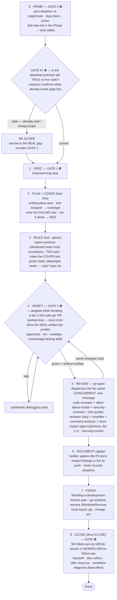
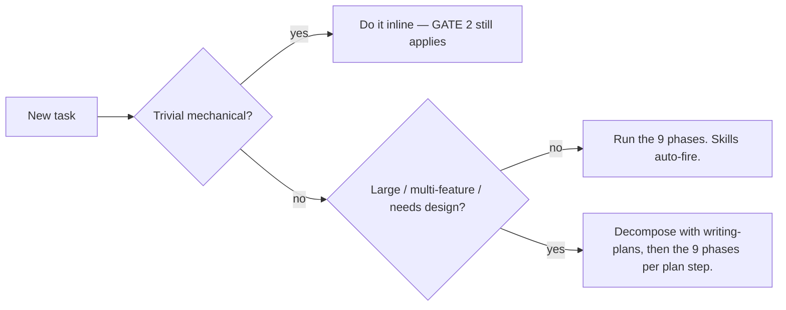

# Canonical Dev Workflow (every project, every session)

Last updated: 2026-10-05 23:40

> **THE LAW — Design → Code → Prove.** Shape it before you build it (GATE 1 ⛔), prove it
> with fresh evidence before you call it done (GATE 2 ⛔). Two hard gates, never skipped.
> The *how* of the Design and Prove legs lives in `design-workflow.md` / `verify-workflow.md`.

One workflow, everywhere — **any stack** (web · service/API · CLI/library · data). The discipline is
universal; only _how you drive the real artifact_ in VERIFY and _make the design concrete_ in GATE 1
change by profile (see `verify-workflow.md` / `design-workflow.md`). The **superpowers methodology is
the ambient engine** — its skills auto-fire as their preconditions match, so you rarely invoke them by
name. Don't fight the gates.

Two laws override everything: a `CLAUDE.md` instruction beats any skill, and the **HARD GATES** are
never skipped.

- **GATE 0 — Baseline before anything.** No design/code until you've synced to the current source of
  truth THIS session: `git fetch`, check the behind-count vs `origin/main` (`git rev-list --count HEAD..origin/main`),
  **sync if behind** — an unpushed branch rebases onto `origin/main`; a pushed branch (PR or train member) syncs with `git merge origin/main` (one merge commit; never a force-push), never a raw `git pull` or `git reset --hard` — and diff the live/deployed artifact — not a stale local snapshot. **Always compare against `origin/main` (the fetched remote ref), NEVER bare local `main`** — `git fetch` updates `origin/main` but not local `main`, so `git diff main` / `HEAD..main` silently compares against merged-away state and misreads what landed. When a rebase drops a commit as "patch contents already upstream", **trust the drop** — your change already landed (often under a squash SHA); do NOT re-apply or rebuild it. A worktree is a
  snapshot in time; build on a stale one and you redo work that already exists. **Verify the plan/brief
  premise too**, not just the git base — a plan/PRD is a snapshot as well, often staler than the branch.
  Have research characterize the target surface against live code and emit a tagged
  `[EXISTS]/[PARTIAL]/[MISSING]` + file:line gap list; if the target already exists, re-scope to the
  real gap and re-enter GATE 1 before building. A spawning plan is a hypothesis to falsify, not a contract.
  On a managed repo this is now **machine-enforced**: the `session_prime_gate` PreToolUse check (folded into `pre_tool.py`) BLOCKs the
  first mutation of a file inside the repo until you're in a `.claude/worktrees/` worktree AND primed
  (`/prime-core`) — targets outside the repo and gitignored files are exempt — bypass
  `WORKFLOW:no-worktree` / `WORKFLOW:no-prime` (see the enforcement/gate-roster reference).
- **GATE 1 — Design before code.** No implementation until an approved design exists
  (`brainstorming`; for big work, decompose with `writing-plans`).
- **GATE 2 — Evidence before "done".** No "done/fixed/passing" claim without FRESH output THIS
  turn, across three legs (`verification-before-completion`, matching `verify-workflow.md`'s
  pipeline): the **STATIC leg** — typecheck, lint, unit via `/validate`; the **BEHAVIORAL leg** —
  the behaviour-test regression suite under `bin/test-lock` (targeted test files while iterating, a full suite per PR for a tier-2 PR — tier-0/1 gates on the affected slice — at the final synced head); and the **EXERCISE leg** — driving the
  **real artifact** by profile via the `run`/`webapp-testing` skills (no slash command for this leg;
  `/validate` covers only STATIC). **SHOW the evidence in your report** —
  surface what proves it (screenshot for UI · response body for API · stdout/exit for CLI · output
  rows for data); evidence the user can't see is half-wasted. Run VERIFY **once per batch of
  accumulated changes**, not per micro-edit — one full cycle over the staged whole beats five
  partial cycles.

## The 9 phases


```mermaid
flowchart TD
    P0["0 · PRIME — GATE 0 ⛔<br/>sync baseline vs origin/main · dup-check · prime<br/>(full step list in the Phase → tools table)"] --> G0
    G0{"GATE 0+ ⛔ — is the plan/brief premise still TRUE vs live code?<br/>research confirms what already exists (gap list)"}
    G0 -->|"stale — already built / wrong scope"| RS["RE-SCOPE<br/>narrow to the REAL gap · re-enter GATE 1"]
    RS --> P1
    G0 -->|"current"| P1
    P1["1 · SPEC — GATE 1 ⛔<br/>brainstorming auto"] --> P2
    P2["2 · PLAN + COVER (test-first)<br/>writing-plans auto · test-designer → coverage<br/>write the FAILING test · run it alone → RED"] --> P3
    P3["3 · BUILD (red→green)<br/>native worktree (WorktreeCreate hook provisions) · TDD auto · make the COVER test green (web: playwright-tester → e2e/*.spec.ts)"] --> P4
    P4{"4 · VERIFY — GATE 2 ⛔ — targeted while iterating, a tier-2 full suite per PR<br/>bin/test-lock -- &lt;test cmd&gt;<br/>drive the REAL artifact (by profile)<br/>typecheck · lint · /validate · run/webapp-testing skills"}
    P4 -->|fails| DBG["systematic-debugging auto"]
    DBG --> P4
    P4 -->|"green + artifact-verified"| P5["5 · REVIEW — /pr-open dispatches the tier panel CONCURRENT, one message<br/>code-reviewer + silent-failure-hunter + security-reviewer + test-quality-reviewer (req) + simplifier + comment-analyzer + docs-impact-agent (advisory, tier ≥ 1) · /security-review"]
    P5 -->|"panel changed code"| P4
    P5 --> P6["6 · DOCUMENT (apply)<br/>builder applies the P5 docs-impact findings in the fix push · /write records progress"]
    P6 --> P7["7 · FINISH<br/>finishing-a-development-branch auto · git worktree remove (WorktreeRemove hook backs up) · /merge-prs"]
    P7 --> P8["8 · CLOSE (docs-CLOSE) — GATE ⛔<br/>file follow-ups as GitHub issues or WORKFLOW:no-follow-ups<br/>/handoff · /dev-reflect · offer /improve · /workflow-diagrams (best-effort)"]
    P8 --> Done([Done])
```

## Phase → tools

| # | Phase | Drives it (auto) | Commands / tools |
|---|-------|------------------|------------------|
| 0 | PRIME ⛔ | — | **read the canonical workflow (auto-loaded `~/.claude/rules/workflow.md`; extended refs in the `claude-template-core` plugin) first · invoke `using-superpowers`** · **sync baseline first** (`git fetch` · behind-count vs `origin/main` · sync if behind — unpushed branch rebases, pushed branch merges `origin/main`) · **verify the plan premise vs live code** (gap list) · `gh issue list` (already tracked? avoid dup work) · **`/rc` (concurrent-session check — is another session already on this project/item? avoid a shared-checkout collision)** · `/prime-core` · `/project-status` · context-map |
| 1 | SPEC ⛔ | `brainstorming` | **grill-me (required)** · a **Mermaid diagram** of the design (required) · **see `design-workflow.md`** |
| 2 | PLAN + COVER (test-first) | `writing-plans` | **grill the PLAN** (2nd required grill — `grill-me` on the plan's step-sequencing / interfaces / failure-modes, recorded in the plan's `## Grill findings`; `grill_gate` blocks a plan commit without it) · **test-designer** (behaviour / user-flow coverage) · **write the failing behaviour test** (web: **playwright-tester** → `e2e/*.spec.ts`) · **run JUST that test** (`bin/test-lock -- <it>`) → confirm **RED** (rest of suite stays green; ⚠ NOT `/validate` — that's the full-suite green gate at P4) — **see `design-workflow.md` COVER** |
| 3 | BUILD (red→green) | `test-driven-development` · `executing-plans` | **native worktree** (EnterWorktree / Agent `isolation: worktree` — the `worktree_create` hook provisions fetch·env·PORT·setup) · make the COVER red test green; add tests as code grows · domain skills |
| 4 | VERIFY ⛔ | `verification-before-completion` · `systematic-debugging` | `bin/test-lock -- <test cmd>` (the touched/affected test files in BUILD and fix rounds; a tier-2 full suite per PR at the final synced head, a local run under `bin/test-lock`) · **drive the real artifact** (by profile — the `run`/`webapp-testing` skills; no slash command) · typecheck/lint · `/validate` · **see `verify-workflow.md`** |
| 5 | REVIEW | `requesting-code-review` → `receiving-code-review` | dispatch the **risk-tiered** panel **only through `/pr-open`** (it picks tier 0/1/2 via `claude-template pr-tier`; `--full` forces tier 2; a hand-dispatched panel is not a panel) **CONCURRENTLY in ONE message**, with **`docs-impact-agent` in the same round-1 message at tier ≥ 1**; fix rounds re-run `/pr-open`, which re-dispatches only the lenses on its comment's `Open:` line, then re-runs security + test-quality on the full PR diff once `Open:` is `none` (their markers are head-bound) — tier 2 is: **required** `code-reviewer` (=`/code-review`, owns the code-review verdict) · `silent-failure-hunter` (may escalate) · `security-reviewer` (separate security verdict — `pr_gate` fails CLOSED without `security-review:PASS@head`, bypass `WORKFLOW:no-security`) · `test-quality-reviewer` (separate test-quality verdict — `pr_gate` fails CLOSED without `test-quality:PASS@head`, bypass `WORKFLOW:no-test-quality`) — **advisory** `code-simplifier` · `comment-analyzer` (one comment, no own marker); tier 1 = code + security + test-quality (or the **prose prompt-code** sub-case: code + security + docs-impact with test-quality `WAIVED reason=no-testable-behavior`); tier 0 docs-only = `code-reviewer` only, security + test-quality auto-`WAIVED reason=docs-only` (re-verified by `pr_gate`) — `/security-review` (distinct). A fourth merge-gate axis, `suite:PASS@head` (full-suite green at the final synced head, active only where CI is absent), is machine-asserted alongside the panel axes — `pr_gate` fails CLOSED without it, bypass `WORKFLOW:no-suite`. **Panel edits → re-run VERIFY** |
| 6 | DOCUMENT (apply) | — | the builder applies the P5 **docs-impact-agent** findings in the next fix push (re-reviewed via `/pr-open`) · `/write` for progress.md/CLAUDE.md state · create-readme |
| 7 | FINISH | `finishing-a-development-branch` | `git worktree remove <path>` (the `worktree_remove` hook backs up untracked files + an uncommitted patch first) · `/merge-prs` |
| 8 | CLOSE (docs-CLOSE) ⛔ | — | **file every follow-up / known gap / deferred nit as a GitHub issue** (`gh issue create`), or state `WORKFLOW:no-follow-ups` — enforced by the `stop_gate` Stop hook (close-issue module) · HANDOFF/TASKS ← real PR#/merge state · `/handoff` · `/dev-reflect` · then **offer** `/improve` to mine recurring lessons+telemetry into routed proposal drafts (offer only — the human invokes it) · **offer** `/improve-skills` to action any skill/command proposals `/dev-reflect` surfaced (offer only — the proposal→apply executor for skill improvements) · **`/workflow-diagrams`** (best-effort — refresh the diagram page when interactive; skip headless) · remember · **emit worktree teardown** — `git worktree remove <path>` (the `worktree_remove` hook backs up untracked files + an uncommitted patch and frees the PORT); the branch survives — delete separately with `git branch -d <branch>` once merged. **Multi-PR sessions run `/dev-reflect` ONCE** — `close_gate` demands it at the FIRST post-merge stop and any reflect in the transcript satisfies later merges that session |

## Behaviour tests & real-artifact verification

Design coverage AND the first failing test happen at COVER (PLAN/P2 — the test-first tail of GATE 1),
BUILD turns them green, and VERIFY runs them (the affected test slice while iterating, one full suite per
PR at the final synced head) so nothing breaks silently — two layers:
- **Codified regression:** `bin/test-lock -- <test cmd>` (per-repo lock spans all worktrees). **Test cadence — a tier-2 full suite per PR:** during BUILD and fix rounds run only the touched/*affected* test files — the slice the diff covers plus a fixed smoke floor (your runner's affected-selection mode if it has one, e.g. a `--affected` flag — otherwise the touched test files); run a full suite per PR **only for a tier-2 PR** (logic / gated paths) — a local run under `bin/test-lock` at the final synced head; a **tier-0/1 PR's per-PR gate is the affected slice plus the smoke floor**, no full run required; a contained fix-round delta covered by its own tests needs only a targeted re-run; a change to the test runner or to setup/install scripts, or a release / integration-train close, always gets a full run **regardless of tier** (an affected selector must fall back to the full suite on exactly those foundational changes).
- **Drive the real artifact** *(green ≠ works — by profile)*: **Web UI** → **Chrome DevTools MCP** at
  `http://127.0.0.1:$PORT` (`webapp-testing`, never the blocked Claude-in-Chrome extension — see
  the `local-browser-testing` plugin skill); **Service/API** → hit endpoints (`curl`/HTTP client), assert status+body;
  **CLI/Library** → run it, assert stdout+exit code; **Data** → run on fixtures, assert output
  schema/row counts; **Meta/tooling** *(no runnable app — hooks/scripts/a template like this repo)*
  → run the test suite AND fire the changed unit (trigger the hook / invoke the script) against a
  real input, assert its actual effect. Codify anything you verify interactively as a test.

## How much process? (the only thing you decide)


```mermaid
flowchart LR
    Q[New task] --> Q1{Trivial mechanical?}
    Q1 -->|yes| Inline["Do it inline — GATE 2 still applies"]
    Q1 -->|no| Q2{Large / multi-feature / needs design?}
    Q2 -->|no| Full["Run the 9 phases. Skills auto-fire."]
    Q2 -->|yes| Heavy["Decompose with writing-plans, then the 9 phases per plan step."]
```

- **Trivial** → inline, but GATE 2 still applies.
- **Standard** → the 9 phases; skills fire themselves; don't bypass GATE 1 / GATE 2.
- **Large** → decompose with `writing-plans` (brainstorming per feature), then run the phases per plan step.
- **Batch RELATED items into one branch/PR** — the per-PR gates (grill · review panel ·
  docs-impact · CLOSE) amortize across a batch, so five same-surface fixes in one PR pay the
  overhead once. Never bundle UNRELATED concerns to save gate cost: review quality and revert
  granularity lose more than the gates save.
- **Many small/medium INDEPENDENT tasks at once → an integration train, not one PR each.** Each
  builder works on its own branch in its own worktree and still carries its own spec/plan (no
  per-member PR means no create-time design gate — the coordinator checks it before merging the
  member in). The panel reviews that **branch diff** (round 1 plus fix rounds, same tiers and
  `Open:` / `Fix rounds:` lines as `/pr-open`, recorded per member as a `train-member:` comment on
  the draft PR — never a `pr-open:tier` marker, so `/pr-open`'s own first run there is a full round 1).
  **Member reviews are sized by risk and batched (R7):** low-risk work (docs, manifests, probes,
  test registration) gets `code-reviewer` only, plus `test-quality-reviewer` when it adds real
  assertions; the full panel is reserved for secrets, hooks, CI, merge gates and third-party code
  ingestion. Related train members are reviewed in one panel dispatch with a verdict per member,
  not one panel each. Review-clean branches are merged (merge commit) into one integration branch with one **draft
  PR**, where a single local full-suite run under `bin/test-lock` at the current head is the PR's one full suite — and once `Open:` is `none`, `security-reviewer` and `test-quality-reviewer` re-review the delta diff and post a normal verdict at the new head rather than the whole branch diff again. At the end: one release step (e.g. a version
  bump), `/pr-open` on the integration PR — its normal panel on the whole
  integration diff, plus fix rounds until clean (that final panel is the full tier backstop regardless of how any member was sized) — and a **merge commit** (not a squash) so each task
  stays revertable. On a red result, the failing test points to its branch: eject it by
  **rebuilding** the train from `origin/main` without that member, as a fresh branch + draft PR
  (no force-push; never revert a merge — re-merging later would silently drop the reverted
  changes); re-post the kept members' `train-member:` comments there and close the old draft as
  superseded. When no single branch owns the
  failure, rebuild without suspects one at a time. Large structural changes keep their own PR.
- **Delegate substantial work** to subagents (see `agent-delegation.md`): research → Explore /
  web-researcher; review → code-reviewer (+ silent-failure-hunter); tests → test-designer →
  playwright-tester → browser-tester; docs → docs-impact-agent. Trivial things stay inline.
  Auditors/reviewers hold no locks — **dispatch them async and keep working** (docs-impact runs
  inside the P5 panel; P6 applies its findings).

## Adherence — mandatory, not optional

The gates above are easy to *know about* and still skip under time pressure. They are not advisory. A
growing subset is machine-enforced, not just rule-mandated (see the enforcement/gate-roster reference
for the current roster — what BLOCKs, what WARNs, and every `WORKFLOW:no-*` bypass token).

1. **Design → Code → Prove is mandatory, not a suggestion.** GATE 1 and GATE 2 apply to every task,
   trivial ones included at reduced weight (see "How much process?" above). Skipping a gate because a
   change "looks simple" is itself the failure mode the gate exists to catch.
2. **GATE 0 reads the workflow docs, not just the code.** Before design or code starts this session,
   read this file's GATE 0 / 9-phase spine (and, for project-specific Phase-0 mechanics, the
   `claude-template-core` plugin's `docs/workflow/WORKFLOW.md`) — the live files are authoritative, not
   your recollection of them (see GATE 0 above).
3. **Creative/feature work always starts with `brainstorming`, scaled to the task.** Never skip straight
   to code for anything that adds behavior — scale the *depth* (a one-line tweak gets a one-sentence
   intent check; a real feature gets a full pass), not whether it runs. Don't route around the skill
   because a task feels small (see GATE 1 above).
4. **GATE-0's baseline-sync order (GATE 0 above) runs every session, before touching anything.**
   Skipping it redoes work that already landed — not optional because the tree "looks synced."
5. **PRESSURE-TEST is mandatory at TWO gates — grill the design AND grill the plan.** One grill is not
   enough: implementation-level flaws first surface when the design becomes a concrete plan.
   1. **Grill the DESIGN (pre-spec)** — before writing the spec/ADR, run `grill-me` on the design;
      record each finding + disposition in its `## Grill findings` section. **Grill your own proposed
      solution against live state, not just its internal soundness** — for each mechanism your fix
      introduces, probe the live code/artifact and tag it `[EXISTS]` (already shipped — drop it),
      `[IMPOSSIBLE]` (structurally can't work — redesign), or `[NEEDED]` (real gap — build); an
      `[EXISTS]`/`[IMPOSSIBLE]` mechanism never reaches BUILD. This is GATE-0's `[EXISTS]`/`[PARTIAL]`/
      `[MISSING]` move turned on your OWN fix, not the incoming ask.
   2. **Grill the PLAN (post-`writing-plans`, pre-BUILD)** — run `grill-me` again on the plan's step
      sequencing, interfaces, and failure modes; record those in the plan's own `## Grill findings`
      before any code is written.
   Disposition vocab: fixed / parked-with-ruling / deferred / accepted / resolved / mitigated /
   addressed. The `grill_gate` PreToolUse check (folded into `pre_tool.py`) blocks committing a spec,
   plan (`docs/superpowers/plans/**`), or ADR whose `## Grill findings` is missing or empty (bypass a
   genuinely trivial doc with `WORKFLOW:no-grill`); `grill_nudge` WARNs at write time, covering the
   plan-mode `~/.claude/plans/*.md` path the commit-time block can't reach. A hook can't literally
   invoke `grill-me` — "automatic" means nudge-at-write plus block-at-commit.
6. **P6 DOCUMENT is a HARD GATE, not a nicety.** After any change, run `docs-impact-agent` (never a
   grep sweep) to find the docs the change made stale, then reconcile them before merge — the builder
   applies the P5 `docs-impact-agent` findings in the next fix push. The `stop_gate` Stop hook (docs
   module) blocks a session that committed code but no docs (bypass `WORKFLOW:no-docs`).
7. **Authoring or editing a skill goes through `writing-skills`.** Creating a new skill, changing a
   `SKILL.md`, or verifying a skill before deployment MUST use the skill-authoring methodology — don't
   hand-edit skills ad-hoc (pairs with the `skill-creator` checklist).

## Worktrees & frameworks (hooks-native)

- **Native worktrees are the isolation mechanism for BUILD** — `EnterWorktree`, or the Agent tool's
  `isolation: worktree` for parallel writers. The **`worktree_create` hook** (WorktreeCreate event)
  provisions each one: `git fetch origin` + behind-warn (GATE 0), gitignored `.env*` carry-in from
  the primary, `SETUP=npm` install, and a collision-free `PORT` written to `.claude/worktree.env`.
  Teardown is `git worktree remove <path>` — the **`worktree_remove` hook** (WorktreeRemove event)
  first backs up untracked/ignored files plus an uncommitted-changes patch to
  `~/.local/share/claude-template/backups/` and frees the PORT. One writer per worktree; read-only
  auditors/researchers need no worktree at all.
- **Suite serialization is `bin/test-lock -- <cmd>`** — one lock per repo (keyed by the git common
  dir, shared across every worktree); a contended run prints the holder and exits 75. **Agents use
  `bin/test-lock --wait [--timeout SECS] -- <cmd>`** — a FIFO queue that blocks until it's your
  turn (exit 75 only on timeout); never hand-roll an exit-75 retry loop. The
  `test_lock_enforce` PreToolUse check (folded into `pre_tool.py`) denies raw suite runs so the lock can't be forgotten.
- **Parallel PRs → merge queue.** Each PR lives in its own worktree; build, fix rounds, panel reviews
  and targeted tests run concurrently across PRs. The **full suite is serial on purpose** (one
  per-repo test lock, and concurrent suites overload the machine and make timing tests flaky), so it
  runs by slot:
  1. The builder runs only targeted test files, pushes, reports `READY FOR SUITE <pr#> <sha>`, and waits.
  2. The coordinator grants a slot to one PR at a time.
  3. At its slot the builder syncs: `git fetch` → `git merge origin/main` (a merge commit, never a
     force-push) → any repo-specific sync steps → targeted tests → push. The full suite (R4) is a
     single local run under `bin/test-lock` at the slot's synced head — that run is the PR's one full
     suite (there is no CI).
  4. Review runs through `/pr-open` and finishes **before** the slot: round 1 is the tier's full panel
     plus `docs-impact-agent` (tier ≥ 1) on the first ready push. A fix round does not re-dispatch a panel on the `Open:` lenses (R6). Instead, prove each finding fixed with a test that fails
     before the fix and passes after. `code-reviewer` reviews the fix delta every round. The gating
     lenses (`security-reviewer`, `test-quality-reviewer`) re-review the delta diff — or the full PR
     diff when the delta touches a gated path or a lens answers `NEEDS-FULL` — and post their
     verdicts at the new head. Never bump a version in a fix round — only at the slot.
     A re-sync whose only delta is `main` is covered by targeted tests; a test-runner or setup-script
     change needs a full run.
  5. Once the local full suite finishes green under `bin/test-lock`, `/pr-open` posts the verdict
     markers bound to that head sha; the coordinator squash-merges, then grants the next slot. (Many small independent tasks:
     use the integration train above instead of one slot per PR.)

  ```mermaid
  flowchart LR
      B["builder: targeted tests · push"] --> R["READY FOR SUITE pr sha"]
      R --> S{"slot granted"}
      S --> Y["fetch · merge origin/main · repo sync steps"]
      Y --> T["full suite once (bin/test-lock)"]
      T --> M["verdict markers @head sha"]
      M --> Q["squash-merge → next slot"]
  ```
- **Teammates are in-process Agent-tool spawns** (SendMessage coordination); the `teammate_idle`
  hook (TeammateIdle event) keeps one working while it still owns tasks. Figma work uses the
  official Figma MCP / claude-in-chrome paths.
- **`gh pr merge` with `main` or the PR branch checked out in ANY worktree** fails its LOCAL
  cleanup as a unit but **the REMOTE merge already succeeded**. Don't re-merge: confirm
  `git log origin/main` shows the squash commit, remove the holding worktree, then finish the
  cleanup with **`bin/pr-merge-recover [<pr#>]`** (verifies the PR is MERGED before deleting the
  remote + local branch — fail-closed and idempotent, and fast-forwards the primary checkout's main
  after a confirmed merge (ff-only, clean, on trunk, no peer session)), or by hand
  (`git push origin --delete <branch>`).
- **A self-authored `gh pr merge` is gated by the auto-mode classifier** (`[Self-Approval]` /
  `[Merge Without Review]` / `[Merge Without CI]`) even WITH a `WORKFLOW:no-*` bypass token, and also
  requires `--match-head-commit <full-40char-headRefOid>` (which closes the review→merge race). Clear
  it the honest way — valid `@head` verdict markers from the real reviewers (attended), never a bypass
  token; if the classifier still denies, hand the `gh pr merge` to the user's terminal and do NOT retry
  the bypass-token form (it keeps getting denied). (Seen 3x — self-authored merges routinely route to
  the user's terminal.)
- **A stale `.git/worktrees/<name>` admin entry can pin `main`** after an incomplete `ExitWorktree`
  teardown (its `HEAD -> refs/heads/main`), so a later `git checkout main` or `gh pr merge` local
  cleanup fails with `'main' is already used by worktree at …`. **`session_start` now auto-heals the
  worktree area** every startup — a blocked `ExitWorktree` (it reports success but its `git worktree
  remove` is denied by the concurrent-worktree / shared-checkout guards) leaves leftovers, so startup
  (1) prunes gone-dir entries, (2) force-removes any `.claude/worktrees/*` entry claiming `main` (the
  pin-`main` corruption signature), (3) **reaps MERGED clean `.claude/worktrees/*` worktrees** via plain
  `git worktree remove` (never `--force` — a dirty tree is refused, so in-progress work is never lost;
  the branch ref survives, so unpushed commits are never lost), and (4) **sweeps orphaned paths**
  (direct children of `.claude/worktrees/` not in `git worktree list`) by backing them up to
  `~/.local/share/claude-template/backups/<name>-<ts>/` then removing them (never an unbacked path),
  never touching the current worktree or the primary — so the next session self-heals. If you hit the
  pin-`main` case mid-session before then: `git worktree prune` WON'T clear it while a residual dir
  lingers — use plain `git worktree remove <path>` (it refuses a genuinely live tree), then
  `git worktree prune`. (Details: the hook layer's reference for the session_start entry.)
- **Rules vs. hooks — where does a new guardrail go?** A thing that's judgment/style is a **rule**
  (this file and its siblings) — Claude *should* follow it, enforced by goodwill + review. A thing
  that can be checked deterministically at a tool call is a **hook** — the runtime *won't let* it
  happen, regardless of what Claude decides. See the hook layer's reference for the full boundary + the
  event model (`PreToolUse` hard-blocks via deny; blocking events like `WorktreeCreate`, `Stop`, and
  `TeammateIdle` block via exit code; the rest inject context or nag at a turn boundary).

## See also

- Extended workflow reference docs (FIELD-GUIDE · WORKFLOW · HOOKS · ENFORCEMENT · FIGMA-UI ·
  AUTOPILOT · CRON) ship in the `claude-template-core` plugin under `docs/` — start at
  `FIELD-GUIDE.md` (the single index) and open the rest from there (plugin-native, not copied
  per-repo).
