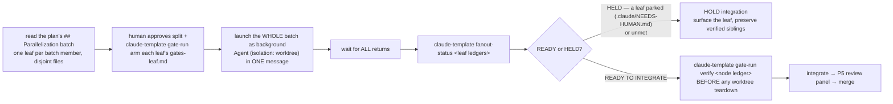

# depth-fanout — concurrent gate-verified leaves under one node gate

A plan's `## Parallelization` callout lists batches of tasks that own **disjoint files** and may run at
once. This skill is the driver ritual for one such batch: fan it out as N concurrent leaf builds, each
gate-verified in its own worktree, then integrate them behind ONE node gate that proves the cross-child
surface no single leaf owns. The attended root (human arms + approves the split) bounds the unattended
leaves (agents build against a pre-approved gate).

`claude-template fanout-status <leaf ledgers>` is the readiness oracle — it HOLDS integration while any leaf is
unmet OR parked. `claude-template gate-run` drives each ledger (arm once, verify in the loop). The parent gate is
authored from `templates/GATES-node.md`.

## The loop

## Steps

1. **One leaf per `## Parallelization` batch member.** Each leaf is a task that owns **disjoint files**
   from its batch siblings (already enforced at plan-commit by `parallel_gate`). Give each its own native
   worktree (`Agent` with `isolation: worktree` — the `worktree_create` hook provisions fetch·env·PORT).
2. **Each leaf gets its own `gates-leaf.md`.** The `gates` skill authors it (one gate per leaf checkbox,
   a success-only `EXPECT:`). The node gate is separate — copy `templates/GATES-node.md` to the parent
   plan's `<plan>.node.gates.md` and replace every `<...>` placeholder.
3. **Human approves the split + arms each leaf (attended root).** `claude-template gate-run arm <leaf gates-leaf.md>`
   for each leaf — the human reviews each CHECK (arbitrary shell) and approves. This is the security
   boundary; never auto-approve on the human's behalf. Arm the node gate the same way.
4. **Launch the whole batch in ONE message.** Dispatch all leaves of the batch as background `Agent`
   spawns (`isolation: worktree`) **in one message** — this is the concurrency barrier. Split across
   messages and they serialize; the fan-out is lost. One writer per worktree.
5. **Wait for all returns, then read the oracle.** After every leaf agent returns, run
   `claude-template fanout-status <leaf-a gates-leaf.md> <leaf-b gates-leaf.md> …`. Exit 0 + `READY TO INTEGRATE`
   means every leaf gate is met AND no leaf is parked. Exit 1 + `HELD` means hold.
6. **A parked leaf HOLDS integration — never integrate an abandoned child.** If a leaf wrote
   `.claude/NEEDS-HUMAN.md`, `fanout-status` reports `HELD` and names the `NEEDS-HUMAN` sentinel even
   when that leaf's gate is met. Surface the parked/unmet leaf to the human and **preserve the verified
   siblings** — do not tear their worktrees down or discard their work. Resolve the held leaf, re-verify,
   then re-read the oracle.
7. **Run the node gate BEFORE worktree teardown.** Once `fanout-status` is `READY TO INTEGRATE`, run
   `claude-template gate-run verify <node ledger>` while the leaf worktrees still exist. N1 reverifies every child
   from its exact ledger (green leaves can rot by integration time); **N2 must exercise the cross-child
   surface no single leaf owns** — a node gate without a real N2 is under-specified. Only after the node
   gate is met do you integrate and tear the worktrees down.
8. **Integrate → P5 panel → merge.** Run `/pr-open` on the integrated branch (tier panel +
   docs-impact), fix rounds until `Open: none`, then merge. Never hand-dispatch the panel.

## Interview

Run these one at a time (AskUserQuestion) before fanning out:

1. **Which `## Parallelization` batch am I fanning out?** (Recommended: the first batch whose tasks are
   all unblocked — one leaf per batch member.)
2. **Are each leaf's `Create:`/`Modify:` files genuinely disjoint from its batch siblings?** (Recommended:
   confirm against the plan — `parallel_gate` enforces this, but confirm before spawning so a merge
   collision can't surface after the work is done.)
3. **What is the ONE cross-cutting outcome N2 must prove — the behaviour no single leaf owns?**
   (Recommended: the end-to-end path that only exists once the leaves are integrated; this becomes the
   node gate's N2.)
4. **Attended (arm the leaves now) or defer?** (Recommended: attended — the human `claude-template gate-run arm`s each
   leaf + the node gate up front, so the unattended leaf builds run against a pre-approved gate.)

## Verify

- `bash tests/test_depth_fanout.sh` → green (end-to-end: N concurrent leaves + node gate + negative and
  abandoned controls).
- `claude-template gate-run status <node ledger>` (i.e. `gate-check --status` on `GATES-node.md`) → parses and names
  its gates; `ALL MET` only once every child reverifies and the cross-child N2 passes.

## See also

This skill IS the native equivalent of unlazy's dropped Depth Tree / OWNS leases / dispatch waves —
worktrees + `parallel_gate` + `fanout-status` replace them, deliberately (do not port the unlazy
layers back). The drop rationale + the full dropped-layer→native mapping live in `bin/gate/README.md`
("Why only a subset"), ruled in the design spec
`docs/superpowers/specs/2026-08-28-unlazy-gate-ledger-adoption-design.md`. Pairs with the `gates`
skill (authoring each leaf/node ledger) and `agent-delegation.md` (the `## Parallelization` batch DAG).
