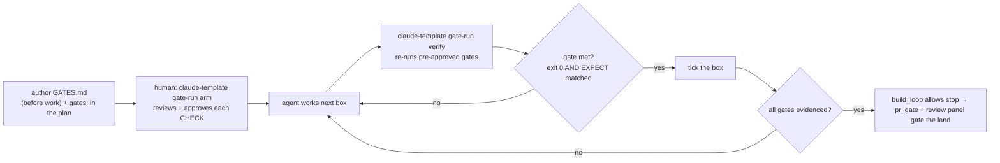

# gates — command-verified completion for autonomous runs

`build_loop` will drive an `autonomy: unattended` plan until its boxes are ticked — but a box is
ticked on the agent's say-so. This skill closes that gap: a plan with a `gates:` frontmatter key is
"complete" only when every gate in its ledger has **real, command-verified evidence**. The executor
is the vendored `claude-template gate-check`; you drive it through `claude-template gate-run`, which pins a canonical
env so a human's one-time approval stays valid for the unattended loop.

## The loop

## Steps

1. **Author the ledger BEFORE work.** Copy `templates/GATES.md` to
   `docs/superpowers/plans/<plan-basename>.gates.md`, one gate per plan checkbox. Add
   `gates: docs/superpowers/plans/<plan-basename>.gates.md` to the plan frontmatter (alongside
   `autonomy: unattended`). `build_loop` skips `*.gates.md` files when resolving the plan.
   *Retiring a plan:* add `status: done` (or `status: abandoned`) to the frontmatter and `build_loop`
   treats it as not-active — it stops driving even with unchecked boxes, so a finished/abandoned plan
   merged on `main` is never a tripwire. A plan with no `status:` key stays active.
2. **Author gates that can FAIL.** Each runnable gate observes the outcome directly and its `EXPECT:`
   is a **success-only marker** the CHECK prints *after* every assertion passes — never a word that
   failure output also contains. Measure numbers from source; never copy a briefed figure into `EXPECT:`.
   Lint before arming: `claude-template gate-lint <ledger>` (fix errors; sharpen on warnings).
3. **Use only canonically-available tools in a CHECK.** `claude-template gate-run` pins `PATH` to
   `node`'s dir + `/usr/bin:/bin` + `~/.local/bin` (the `claude-template` dispatcher dir, so a CHECK may
   invoke `claude-template <helper>`) + the repo `bin/`, and `UNLAZY_SHELL=/bin/sh`. This determinism is
   what makes the arm-time approval transfer to unattended loop-time — a CHECK that reaches for a tool
   outside that PATH will fail (correctly) rather than pass unreproducibly.
4. **Arm once (human).** `claude-template gate-run arm docs/superpowers/plans/<plan-basename>.gates.md` — the human
   reviews each CHECK (it is arbitrary shell), approves, and the first run records evidence. This is the
   security boundary; do not auto-approve on the human's behalf.
5. **Verify, then tick.** During the loop, after finishing a box run
   `claude-template gate-run verify <ledger>` — it re-runs only the pre-approved gates (no new approval) and
   refreshes `EVIDENCE:`. Tick a plan box only when its gate is met. **A checked box with
   `EVIDENCE: pending` is UNMET** — `build_loop` reads that as "not done" and keeps driving.
6. **A changed CHECK re-requires approval.** If you edit a CHECK mid-run, its approval invalidates and
   `verify` prints `APPROVAL REQUIRED`; the loop stays incomplete and eventually parks to a human for
   a re-arm. That is correct — a new command a human never reviewed must not run unattended.
7. **Abandon honestly.** If a gate is genuinely impossible, keep it and add `ABANDON: G<n> <reason>` at
   column 1. It is a terminal HANDOFF, never a pass; never promote an abandoned gate to "complete".

## Interview

Run these one at a time (AskUserQuestion) before authoring the ledger:

1. **What is the ONE observable outcome that means this plan actually worked?** (Recommended: the
   plan-named acceptance test going green under `bin/test-lock`.) This becomes G1.
2. **Which outcomes need a SEPARATE gate vs. folding into G1?** (Recommended: one gate per independently
   omittable requirement — a lint/typecheck gate, a behaviour gate, a negative-control/mutation gate.)
3. **Is any required outcome impossible to decide by command?** (Recommended: make it runnable if you
   can; only fall back to a manual gate — reviewed by risk — when no command can decide it.)
4. **Will this run unattended (armed) or attended?** (Recommended: attended unless you genuinely want
   `build_loop` to drive it — an unattended run needs the human to `claude-template gate-run arm` up front.)

## Verify

- `claude-template gate-lint <ledger>` → `LINT OK` (no errors).
- `claude-template gate-run status <ledger>` → reports state without executing.
- After arming + a real run: `claude-template gate-run status <ledger>` → `ALL MET` only when every gate is evidenced.

## See also

The executor is a vendored SUBSET of unlazy — only the gate-checker (layers 1+2). unlazy's Depth Tree,
OWNS leases, dispatch waves, and blocking Stop hook were deliberately dropped (they duplicate
worktrees + `parallel_gate` + `build_loop`); the rationale + the dropped-layer→native mapping are in
`bin/gate/README.md` ("Why only a subset"), ruled in
`docs/superpowers/specs/2026-08-28-unlazy-gate-ledger-adoption-design.md`. For parallel fan-out of
gate-verified leaves under a node gate, see the `depth-fanout` skill.
