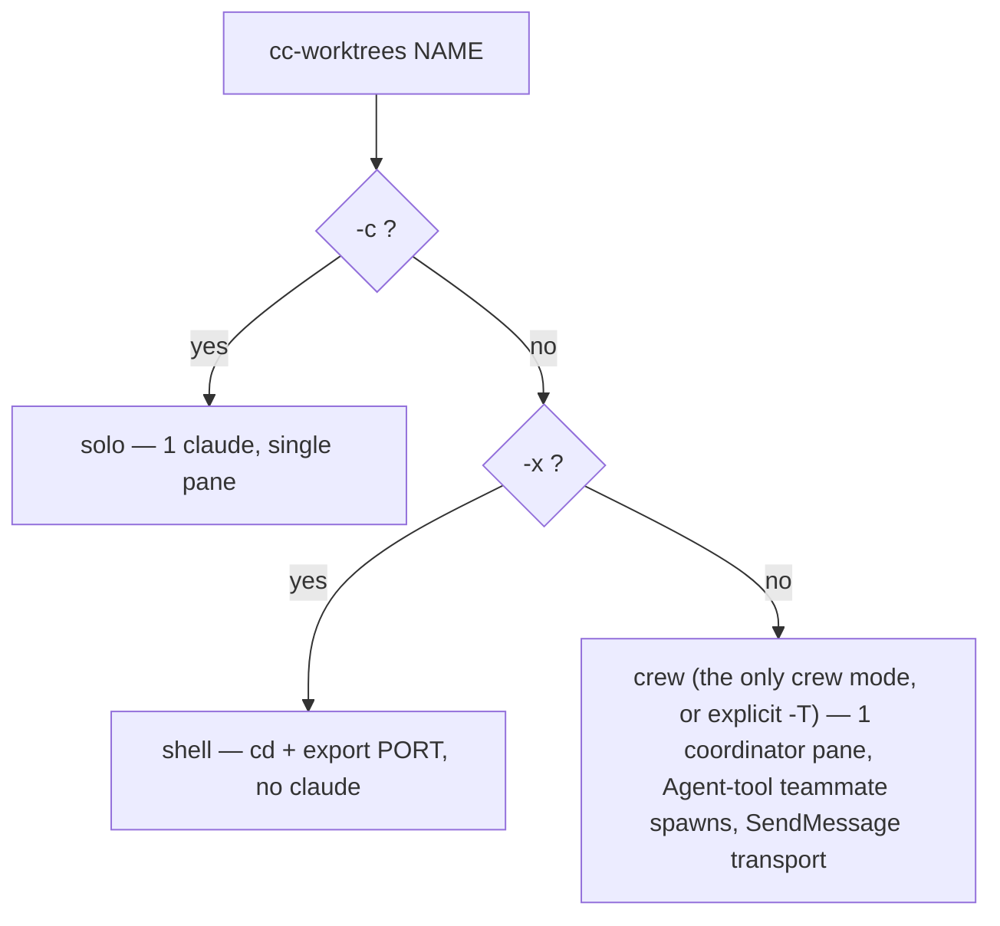

---
note-reader:
  - 7075cb2c7a6a39fabe031e2a6d5f12cf68cc553166e75120284de35101cd2e6c|17263
---

# cc-worktrees

Last updated: 2026-08-10 01:49

> **BUILD-phase isolation & parallelism.** One git worktree per feature (a sibling of the repo),
> each on its own free port and its own tmux pane — optionally a Claude **crew** (one
> coordinator pane + Agent-tool teammates over SendMessage) that runs the Design → Code → Prove spine
> for that worktree. A per-repo **test lock** serializes automated runs against the shared local
> stack. Works in _any_ git repo (`~/.local/bin/cc-worktrees`).

This is the isolation layer referenced throughout `WORKFLOW.md` (phase 3 BUILD / phase 7 FINISH).
It is a single **bash** script with no install step beyond putting it on `PATH` — but the crew/solo
modes require `tmux` (plus `git`/`lsof`/`awk`), and the Figma path additionally uses
`jq`/`node`/`bun`/`curl`/`osascript`.

---

## Quick start

```bash
cc-worktrees feat/login fix/crash     # 2 worktrees; each opens a crew (1 coordinator + Agent-tool teammates)
cc-worktrees -c feat/login            # solo: one interactive claude in the worktree (no crew)
cc-worktrees -x feat/api              # shell only: cd + export PORT, no claude (lightweight)
cc-worktrees login                    # bare slug → branch "login", flat worktree dir
cc-worktrees -t feat a b              # category once → feat/a, feat/b
cc-worktrees ls                       # worktrees + reserved ports + test-lock holder
cc-worktrees test -- npm test         # run a command holding the per-repo test lock
cc-worktrees rm feat/login            # guarded remove (refuses dirty unless -f); keeps the branch
cc-worktrees init                     # scaffold .claude/worktrees.conf (autodetected)
cc-worktrees help                     # full usage
```

Each worktree lives at **`<repo>-worktrees/<name>`** — a _sibling_ of the main repo, never nested
(even when you run the command from inside another worktree). The tmux session is per-worktree:
`ccwt-<repo>-<slug>` (slug = the worktree name with `/` → `-`; a short deterministic suffix is
appended only if two differently-named worktrees sanitize to the same slug and would otherwise
collide).

**New branches base on the current `origin/<default>` (GATE 0, automatic).** Create first runs
`git fetch origin` and branches each new worktree off the freshly-fetched default branch — never the
local (often-stale) `main` — so you never start work behind origin. Override with `CCWT_BASE` (e.g.
`CCWT_BASE=origin/develop`, or `CCWT_BASE=HEAD` to base on your current checkout for stacked work).

---

## Commands

| Command                                                                      | What it does                                                                                                                                     |
| ---------------------------------------------------------------------------- | ------------------------------------------------------------------------------------------------------------------------------------------------ |
| `cc-worktrees [-c\|-x\|-T] [-b PORT] [-t CAT] [--review-dock] [--figma] <name>…` | Create worktree(s) + a tmux pane each. Mode = **crew** (1 coordinator + Agent-tool teammates) — the only crew mode; `-T` is accepted as an explicit no-op alias.                                                                    |
| `cc-worktrees add <name>…`                                                   | **Teammate-worktree primitive** (#162): worktree + branch (GATE-0 base) + free PORT + `COPY_FILES` env carry-in + install — **no session, no pane, no claude, no crew**. Prints eval-able `WORKTREE=`/`PORT=`/`FIGMA_CHANNEL=` lines. The crew coordinator runs this to provision an EXTRA implementer's worktree and hands the teammate the path — teammates never run cc-worktrees themselves. |
| `cc-worktrees ls`                                                            | `git worktree list` + live port reservations + the per-repo test-lock holder.                                                                    |
| `cc-worktrees rm [-f] <name>…`                                               | Guarded remove: refuses a dirty worktree unless `-f`; on `-f` **backs up untracked/ignored files** (e.g. `.env`) AND **uncommitted tracked modifications as an applyable patch** (`uncommitted-tracked.patch` — recover with `git apply`) first, archives `crew/*.md`, frees the port, prunes the empty category dir, **keeps the branch**. Warns loudly when the BOARD claims DONE but the branch has **zero commits** (work-loss guard). |
| `cc-worktrees test [--] <cmd>…`                                              | Run `<cmd>` while holding the per-repo test lock (a second `test` blocks until the first releases).                                              |
| `cc-worktrees figma <doctor\|up [--run-last]\|probe\|confirm> [ch…]`         | talk-to-figma bridge: the **nine guards**, relay + Figma launch, and **live-channel proof** (see [Figma bridge](#figma-bridge-talk-to-figma)).       |
| `cc-worktrees figma import-plugin [manifest]`                                | UI-scripts the dev-plugin manifest import into the FOCUSED Figma window, verifies it landed by reading the menu back, then runs it by name (default `figma-plugin/manifest.json`). |
| `cc-worktrees revive <worktree> [role]`                                      | Relaunch an accidentally-closed crew claude **in its original pane**, resuming its original session (`<ROLE>_SESSION` from `crew/panes.env`; pre-session-id crews fall back to the coordinator marker or claude's `--resume` picker). Refuses a pane that is still running something. **Under crew mode (the only mode), only `role=coordinator` (the default) actually revives; passing any other role always errors** — individual teammates are separate OS processes that die/survive independently of the coordinator and are not individually revivable (see RECONCILE-ON-RESUME in the Crew section). To recover a dead teammate pane, revive the coordinator; its RECONCILE-ON-RESUME contract reconciles against live teammate processes before spawning replacements. |
| `cc-worktrees init`                                                          | Write `.claude/worktrees.conf` with autodetected `SETUP`/`PROFILE`/`BASE_PORT`.                                                                  |
| `cc-worktrees help`                                                          | Usage.                                                                                                                                           |
| `cc-worktrees selfupdate`                                                    | Refresh the installed `~/.local/bin/cc-worktrees` from the source sentinel `setup.sh` wrote. **Refuses** a sentinel pointing into a transient `*-worktrees/` checkout (which would deploy stale, branch-drifted code).                                            |

### Create modes

**crew is the only crew mode** (human decision, explicit — classic was removed entirely; see
[Crew](#crew-default) for the honest recovery caveat that comes with it).

| Mode                     | Flag                | Result                                                                                                                                |
| ------------------------ | -------------------- | ------------------------------------------------------------------------------------------------------------------------------------- |
| **crew**               | — (or explicit `-T`) | ONE coordinator pane (`crew-coordinator`); teammates are **Agent-tool spawns** (`teammateMode: tmux` → each gets its own pane), transport = **SendMessage**. No dispatch.sh/crew_wait.sh/crew_status.sh; durable `crew/*.md` + BOARD kept. `-T` is accepted as a no-op explicit alias — it never errors, for existing muscle memory/scripts. See [Crew](#crew-default). |
| **solo**                 | `-c`                 | One interactive `claude` in the worktree, single pane, no crew.                                                                       |
| **shell**                | `-x`                 | Just a shell (`cd` + `export PORT`), no claude — the lightweight option.                                                              |



### Names

- `feat/login` → category/slug → branch `feat/login`, dir `<repo>-worktrees/feat/login`
- `login` → bare slug → branch `login`, flat dir `<repo>-worktrees/login`
- `-t feat a b` → apply category `feat` to bare slugs → `feat/a`, `feat/b`

### Flags

| Flag            | Scope  | Meaning                                                                                        |
| --------------- | ------ | ---------------------------------------------------------------------------------------------- |
| `-b PORT`       | create | Base port for the free-port search (default `3000`; in-use/reserved ports auto-skipped).       |
| `-t CAT`        | create | Default category applied to bare slugs.                                                        |
| `-T`            | create | Explicit alias for crew (the only crew mode) — accepted, never an error, for existing scripts/muscle memory. |
| `--review-dock` | create | Scaffold the in-page review dock — dev (zero-config) + opt-in prod (see below).                                         |
| `--figma`       | create | Scaffold the SVG→Figma bridge (see below). `FIGMA_SCAFFOLD=1` makes this the per-repo default. |
| `--no-figma`    | create | Skip the Figma scaffold even when `FIGMA_SCAFFOLD=1` makes it the per-repo default.            |
| `-f`            | rm     | Force-remove even with uncommitted/untracked changes (untracked + ignored files backed up, tracked modifications saved as an applyable patch — see safety). |
| `--no-attach`   | create | Skip the final tmux attach; print `tmux attach -t <session>` and exit 0 (for headless/scripted launchers). |
| `--brief FILE`  | create | Point the crew coordinator's kickoff prompt at an absolute FILE (must exist at parse time — fails loud, no fallback), instead of the default `Form your crew now (crew).` |

---

## Remote Control

Every crew launch (crew's coordinator, `solo`, and `revive`) gets `--remote-control` by default,
letting you drive that session from the Remote Control app on your phone.

**Prerequisite: `claude.ai` login.** Remote Control requires signing in via `claude /login` (run
once per machine/directory) — **API-key auth is NOT supported**, and Team/Enterprise plans may need
an org admin to enable it. Unlike most flags, `--remote-control` **hard-errors the launch instead of
prompting** when you're not eligible — so `cc-worktrees` never adds it blindly. Before every
`create`/`revive`, it runs a fast, side-effect-free pre-flight (`claude auth status --json` — no
session start, no API call, ~0.3-0.4s, hard-capped at 5s if the probe hangs so a stuck `claude` binary
can never hang `create`/`revive` indefinitely) and only adds the flag when it reports `loggedIn: true` and
`authMethod: "claude.ai"`. If you're not eligible, crew creation still succeeds — you just get a
one-line warning telling you to `claude /login`, and every pane launches exactly as it would have
without Remote Control. **Known gap:** the pre-flight cannot detect a Team/Enterprise org-admin
policy that disables Remote Control org-wide (`claude auth status` exposes no such field, and no
other cheap probe for it is known) — that residual case degrades safely (Remote Control just silently
isn't available on that pane) but isn't caught in advance.

Disable it outright with `CREW_REMOTE_CONTROL=0` in `.claude/worktrees.conf` (per-repo) or the global
conf (machine-wide).

**Crew caveat:** crew's coordinator is the only process this tool LAUNCHES with a
`--remote-control` flag. Teammates ARE separate OS processes — **not in-process spawns** (a claim
this doc used to make and has retracted; see [Crew](#crew-default) below for the
corrected lifecycle) — but the Agent tool spawns them without their own remote session, so the
coordinator's one remote session covers the **whole crew as a unit**, not each teammate individually.
Reaching a specific teammate over Remote Control means driving it *through* the coordinator, the same
way SendMessage does — one whole-crew session, not one per teammate.

---

## Crew (default)

The crew transport (`docs/lessons.md` #121–#123), **the only crew mode**
(human decision, explicit — classic was removed entirely; see the caveat two paragraphs down; `-T`
still works as an explicit no-op alias): ONE coordinator pane runs
`--agent crew-coordinator` (deliberately **no** `tools:` allowlist — it must inherit the Agent +
SendMessage tools; the v1 allowlist predates agent teams and blocks them). Teammates are spawned
via the **Agent tool** under `teammateMode: tmux`, so each still gets a real pane (the cockpit
survives), but coordination is **SendMessage** — replies return fresh and complete, so the
send-keys plumbing (`dispatch.sh`, `crew_wait.sh`, `crew_status.sh`) is not scaffolded and the
`[pane-transport]` lessons (#98/#105/#107) don't arise.

**⚠ Lifecycle — RETRACTED CLAIM, corrected here.** This doc previously claimed crew teammates
shared the coordinator's own process lifecycle (spawned inline, dying together). **That was FALSE**,
verified live via `ps` against a real running crew (not assumed): teammates are **SEPARATE OS processes**,
parented by the **tmux server** — **siblings of the coordinator, not its children**. If the
coordinator dies (crash, kill, or session end), teammates do **NOT** die with it — they **SURVIVE**
as **orphans**: still running, still able to write the shared worktree, reporting to nobody. A naive
`revive` that just relaunches the coordinator would then spawn a **second** set of teammates onto the
**same** worktree — two writers, one worktree, breaking the single-writer invariant the whole design
rests on, via the recovery procedure itself. The fix (Phase 2, `crew/DESIGN.md`): the coordinator's
contract now has a mandatory **RECONCILE-ON-RESUME** step — before spawning anything after a crash,
`revive`, or auto-compaction, it must re-read `crew/BOARD.md` + `crew/DESIGN.md` and check for live
teammate processes before assuming a role is unstaffed. `revive` itself only knows how to relaunch
the coordinator (teammates are not individually `cc-worktrees`-managed — no `@ccwt_wt` tag, so this
tool cannot own or kill them); an orphan check there is detect-and-report, not an automatic kill (a
pattern-matched process kill on the wrong session id could reap a live, unrelated crew).

Contract highlights (full text: `write_coordinator_prompt` in `bin/cc-worktrees`):
- **★ RECONCILE-ON-RESUME** — before spawning anything after a crash/revive/compaction: re-read
  BOARD.md + DESIGN.md, reconcile against live teammate processes, never spawn a role that already
  has one. See the lifecycle note above.
- **Turn-1 transport preflight** — assert Agent + SendMessage are held (a DEFERRED tool counts:
  ToolSearch-load it); truly missing → loud `TRANSPORT-VERDICT: NO-GO`, never fabricate teammates.
- **THE TEST LOCK IS MANDATORY** — SendMessage coordinates messages, not state; every suite run
  (coordinator included) goes through `cc-worktrees test -- <cmd>` or concurrent teammates produce
  false reds on the shared worktree.
- **Model policy is stated, not accidental** — `CREW_TEAMMATE_MODEL` (below), recorded in DESIGN.md.
- Durable records unchanged: the coordinator-named result file (`crew/<role>.md` for a lone
  instance, `crew/<role>-<slug>.md` when several instances share a role) + append-only BOARD;
  "idle" is a point-in-time signal — consult the BOARD before re-assigning.
- **N instances per role (#162/#163)** — roles are a catalogue, instances are runtime; the role
  set never grows. Scale by WRITE ACCESS: N read-only auditors/researchers can share a worktree
  (two auditors on one diff through different lenses is diversity); every extra **implementer**
  gets its OWN worktree, provisioned by the coordinator via `cc-worktrees add` — never by the
  teammate itself (the create default spawns a whole crew). The single-writer invariant is
  per-WORKTREE, not per-role; the coordinator names each instance's result file + diff range in
  every assignment, titles each pane (`select-pane -T <role>-<slug>`), and acts as the serial
  merge queue (fresh PR for post-merge follow-ups; `git merge-base --is-ancestor` on every
  "pushed" claim). Ceiling: one shared DB, one test lock, one PR queue — scale only file-disjoint,
  non-DB-heavy stories.
- Remote Control covers the coordinator only (the crew's one `claude` process) — see
  [Remote Control](#remote-control) for the whole-crew-as-one-unit caveat.
**crew is the only crew mode; the leader-death/compaction recovery path exists (reconcile-on-resume)
but remains unverified under a real crash.** There is no process-isolation fallback (classic was
removed) — the coordinator's reconcile-on-resume contract is the only recovery path today.

## Configuration — `.claude/worktrees.conf`

`cc-worktrees init` autodetects and writes this; it is sourced on every create. All keys are optional.
A machine-wide **global layer** at `~/.config/cc-worktrees/worktrees.conf` is sourced FIRST (for
machine-level defaults like `FIGMA_SOCKET=1` or `CREW_*`); the per-repo file below always wins.
The template's `setup.sh` is also a writer — it seeds this file at scaffold time (and persists
`STACK_PROFILE` / `TEST_CMD` / `RUN_CMD` below as the machine-readable source for `setup.sh --update`).
Because the file is sourced, command values are written escaped so an embedded quote or `$(…)` is stored
literally and never executed on create. A "data" value (`CREW_MODEL`, `CREW_PERMISSION_MODE`,
`CREW_EFFORT`, `CREW_TEAMMATE_MODEL`, `FIGMA_RELAY_CLONE`) containing an embedded newline is rejected
outright at load time (exit 1) rather than silently corrupting a launch command — fix the malformed
line in the conf file.

| Key                    | Default                                                                              | Meaning                                                                                                                                      |
| ---------------------- | ------------------------------------------------------------------------------------ | -------------------------------------------------------------------------------------------------------------------------------------------- |
| `SETUP`                | autodetect (`npm` if `package.json`, `py-editable` if `pyproject.toml`, else `none`) | First-run dependency install in the pane.                                                                                                    |
| `PROFILE`              | `web` (npm) / `non-web`                                                              | Project profile (cc-worktrees schema: `web` \| `non-web`).                                                                                   |
| `STACK_PROFILE`        | stack profile chosen at setup (`cli`; `web` for node)                                | `web` \| `service` \| `cli` \| `data` — the `docs/WORKFLOW.md` profile, distinct from cc-worktrees' `PROFILE` (which is derived from it). Persisted by `setup.sh`. |
| `BASE_PORT`            | `3000`                                                                               | Base for the free-port search (the `-b` flag overrides).                                                                                     |
| `TEST_CMD`             | —                                                                                    | Persisted by `setup.sh` at scaffold; machine-readable source for the `setup.sh --update` re-stamp (escaped on write; never auto-run here).   |
| `RUN_CMD`              | —                                                                                    | Persisted by `setup.sh` at scaffold; machine-readable source for the `setup.sh --update` re-stamp (escaped on write; never auto-run here).   |
| `CCWT_BASE`            | `origin/<default>` (auto)                                                            | Git ref new branches are based on. Auto-resolves to the freshly-fetched origin default; set `origin/develop`, a tag/sha, or `HEAD` (old local-HEAD behavior) to override. |
| `SETUP_CMD`            | —                                                                                    | Custom install command (overrides `SETUP`'s default).                                                                                        |
| `COPY_FILES`           | `.env .env.*`                                                                        | Gitignored files carried from the main checkout into each new worktree (patterns relative to root; idempotent).                              |
| `NESTED_INSTALL`       | `tests/e2e e2e` (npm)                                                                | Extra dirs with their own `package.json` to `npm install` on create, so the verifier never installs mid-pass.                                |
| `CACHE_WARM_CMD`       | —                                                                                    | Command run after install to warm regenerable caches (avoids cold/flaky first checks).                                                       |
| `DEV_SERVER_CMD`       | —                                                                                    | Opt-in: background-started in the implementer pane after install, then an `lsof` poll confirms it's up on `$PORT`.                           |
| `CREW_ARCHIVE`         | `1`                                                                                  | Archive `crew/*.md` (+ `design-import/`, `design/ref/`) to `<repo>/crew-archive/<branch>/` before `rm`.                                      |
| `CREW_MODEL`           | `claude-opus-4-8[1m]`                                                                | Model each crew agent launches with (`''` = inherit).                                                                                        |
| `CREW_PERMISSION_MODE` | `auto`                                                                               | `acceptEdits\|auto\|bypassPermissions\|default\|dontAsk\|plan`. Set `bypassPermissions` for MCP-heavy crews to avoid numbered-prompt stalls. |
| `CREW_EFFORT`          | —                                                                                    | `low\|medium\|high\|xhigh\|max` for each crew agent (`''` = inherit).                                                                        |
| `CREW_TEAMMATE_MODEL` | —                                                                                    | **crew (`-T`) only**: model for Agent-tool teammates. `''` = each agent def's own model (sonnet for the standard roles — proven); set e.g. `claude-opus-4-8` to upgrade a hard story. The v2 coordinator must STATE the policy in `crew/DESIGN.md`.        |
| `CREW_REMOTE_CONTROL`  | `1`                                                                                  | `1` = add `--remote-control` to every crew launch (crew coordinator, solo, revive) when a fast pre-flight confirms `claude.ai` login (never hard-fails an ineligible launch — see [Remote Control](#remote-control)). `0` = never add it.  |
| `FIGMA_SCAFFOLD`       | `0`                                                                                  | `1` = scaffold the SVG→Figma bridge into **every** new worktree (per-repo default); override per worktree with `--no-figma`.                 |
| `FIGMA_SOCKET`         | `0`                                                                                  | `1` = on create, bring up the talk-to-figma relay (`:3055`) — headless only. Set it in the **global** conf for always-on.                    |
| `FIGMA_LAUNCH`         | `0`                                                                                  | `1` = on create, **also** open Figma Desktop (+ `FIGMA_FILE_KEY`) — deliberately separate from the headless relay.                           |
| `FIGMA_FILE_KEY`       | —                                                                                    | The **project's Figma file** (create one named after the repo folder, paste its key). Opened by `FIGMA_LAUNCH` / `figma up`.                 |
| `FIGMA_CHANNEL_SCOPE`  | `repo`                                                                               | `repo` = ONE channel per project (`<repo>`, all worktrees share file+canvas) \| `worktree` = `<repo>-<slug>` each.                           |
| `FIGMA_CHANNEL_SECRET` | —                                                                                    | Opt-in (set in the **global** conf): channels gain an unguessable `-<fnv1a>` suffix (relay is unauthenticated; names are guessable). Seed the plugin ONCE per machine: type `secret:<value>` into its Channel field.                          |
| `FIGMA_SOCKET_CMD`     | autodetect                                                                           | Relay start command (`''` = autodetect the `claude-talk-to-figma-mcp` clone's `bun run socket`).                                             |
| `FIGMA_RUN_LAST`       | `0`                                                                                  | `1` = best-effort ⌥⌘P "Run last plugin" on `figma up`/create (needs macOS Accessibility permission).                                         |

**Cockpit / terminal env vars:** `CCWT_COORD_COLOR` (default `colour45`) — the coordinator pane's
tmux border colour (any tmux colour, e.g. `colour99`); `CCWT_TERMINAL_CMD` (autodetect) — override the
pane's terminal launch command; `CCWT_NO_TERMINAL=1` — skip launching a terminal side-effect entirely;
`CCWT_TERMINAL_DRYRUN=1` — PRINT the exact terminal command instead of running it (the dry-run idiom).

Environment: `CCWT_TESTLOCK_WAIT` (default `1800`) — max seconds a `test` run queues behind another
before giving up. Cache/lock state lives under `${XDG_CACHE_HOME:-~/.cache}/cc-worktrees`.

---

## Optional scaffolds

Both copy from a shared template store at `${XDG_DATA_HOME:-~/.local/share}/cc-worktrees/scaffold/`
(seed it once; missing store → the flag is a no-op with a notice). Neither ever overwrites an
existing file.

- **`--review-dock`** → an in-page review dock with an element **picker**, **screenshot-on-Send**
  (snapdom — browser work, **0 LLM tokens**; `npm i -D @zumer/snapdom`), and **🎙 voice dictation**
  (Chrome-only). Two modes, gated by the `enabled` prop the root layout computes:
  - **DEV (zero-config default)** — POSTs to `app/api/review-note/route.ts`, which appends to
    `crew/REVIEW-NOTES.md` + writes `crew/review-shots/*.webp`. No auth, no DB.
  - **PROD (opt-in)** — Vercel's FS is read-only, so prod is admin-gated Supabase persistence: a
    `review_notes` row + a shot in a **private** `review-shots` bucket + a signed-URL viewer at
    `/admin/review-notes`. Needs the `review-dock-adapter.ts` (5 auth/DB seam fns you implement — of which
    `isReviewAdmin()` is deliberately **build-safe**: it returns `false` rather than throwing, so an unwired
    project still `next build`s; the other four throw loud) + the `review_notes.sql` migration applied
    **before** the first prod POST. `review-notes.ts` imports `server-only`, so **`npm i server-only`** is
    required for prod mode.

  Scaffolds `{ReviewDock.tsx, review-dock.css, route.ts, shot.ts, review-notes.ts,
  review-dock-adapter.example.ts, admin-review-notes-page.tsx}` + a timestamped
  `supabase/migrations/*_review_notes.sql`. `ReviewDock` takes a `hideOnPaths` prop (default `["/admin"]`,
  segment-matched) to keep the dock off the admin area including its own viewer. Full wiring (incl. the
  dev-server-is-reachable + size-cap security notes) in the scaffold's `WIRING.md`.

  ```mermaid
  flowchart LR
    Dock["ReviewDock<br/>enabled gate · PICK · 🎙 · snapshot"] --> POST["POST /api/review-note"]
    POST --> Q{"NODE_ENV = production?"}
    Q -->|dev| FS["append crew/REVIEW-NOTES.md<br/>+ write crew/review-shots/*.webp<br/>zero-config · no auth"]
    Q -->|prod| GATE{"requireReviewAdmin()<br/>before body parse"}
    GATE -->|not admin| E["401 / 403"]
    GATE -->|admin| DB["service-role insert review_notes<br/>+ upload shot → private review-shots bucket"]
    DB --> VIEW["/admin/review-notes<br/>requireReviewAdminPage → signed-URL viewer"]
    classDef prod fill:#F3F1FE,stroke:#6C5CE0,color:#1A1A2E;
    class GATE,DB,VIEW prod;
  ```
- **`--figma`** → copies the full Figma toolkit into `scripts/` — the config-driven `figma-export.mjs`
  driver plus `page-to-svg.mjs`, `svg-to-figma.mjs`, `figma-page.mjs`, `probe-channels.mjs`,
  `capture-dialog.mjs`, `tokens-to-figma.mjs` (Pipeline A — CSS→Figma variables),
  `rebind-svg-vars.mjs` (Pipeline C — SVG-fill→variable rebind), `dom-to-svg.iife.js`, and
  `figma-export.config.example.json` — plus `docs/{figma-copy.md,FIGMA-EXPORT.md}`. The `svg-to-figma.mjs` path streams `set_svg` straight to the
  talk-to-figma relay (`ws://localhost:3055`), bypassing the agent output cap and the MCP 500 KB limit —
  the sharp page→SVG→Figma path.

---

## Figma bridge (talk-to-figma)

The `cc-worktrees figma` subcommand manages the [talk-to-figma] relay and **proves** a Figma plugin
is actually connected before you trust a channel. It exists because of one hard limit: **Figma has no
API to launch a plugin or read its channel from outside Figma**, so opening the plugin is the single
irreducible manual step (one click per window). Everything around it is automated.

```bash
cc-worktrees figma doctor              # run the nine guards, report, non-zero exit on failure
cc-worktrees figma up [--run-last]     # ensure relay is up + launch Figma (+ FIGMA_FILE_KEY file)
cc-worktrees figma probe   <channel…>  # live-channel proof — get_document_info, real verdict
cc-worktrees figma confirm [channel…]  # prove + record CONNECTED channels into figma-export.config.json
```

### Always-on relay + stable per-worktree channels

Two knobs remove the old per-session channel dance:

- **Loopback-only relay** — the ccwt-patched relay binds `127.0.0.1` (upstream bound ALL
  interfaces: your whole LAN could reach the unauthenticated socket). `figma up`/`create` never
  steal focus when the plugin is already connected (probe-first), UI-scripted runs are verified by
  a live probe (never by the click's exit code), and focus is restored to your previous app after.
- **Relay always-on** — set `FIGMA_SOCKET=1` in the **global** config
  (`~/.config/cc-worktrees/worktrees.conf`; per-repo `.claude/worktrees.conf` still wins) and every
  `create`, in every repo, brings the relay up. It's headless and cheap. `FIGMA_LAUNCH=1`
  (separate, deliberately) also opens Figma Desktop — leave it off for non-design repos.
- **One project = one Figma file = one channel** — `create` computes a deterministic
  `FIGMA_CHANNEL=<repo>` (sanitized to `[A-Za-z0-9_-]`), exports it in **every pane** (beside
  `PORT`), records it in `crew/panes.env`, and prints it. Every worktree of the project talks on
  the same channel and lands on the same canvas (the relay queues commands per channel, so
  concurrent writers serialize safely); a different project uses a different channel — and its own
  Figma file. The **patched plugin** (`cc-worktrees-scaffold/figma/plugin/`, deployed with
  `sync-figma.sh plugin-install`) has a Channel input that **persists** via `clientStorage`: type
  the project's channel once in its Figma file's plugin, and every reconnect rejoins it. Agents
  read `$FIGMA_CHANNEL` — no more hand-passing ids. Prove it live:
  `cc-worktrees figma probe $FIGMA_CHANNEL`.
- **The project's Figma file** — create a file named after the repo (e.g. `unsent`) once, paste its
  key into the repo conf as `FIGMA_FILE_KEY=…`, set `FIGMA_LAUNCH=1` there — every create then
  opens the right file (Figma can only open by key, not name; creating files has no API).
- **Per-worktree channels instead** — set `FIGMA_CHANNEL_SCOPE=worktree` in the repo conf to give
  each worktree its own `<repo>-<slug>` channel (max parallel write throughput / separate files);
  then run one plugin instance per worktree (same file = one window per worktree).

### The nine guards

| #   | Guard             | What it checks                                                                                                                                                                                                                                          |
| --- | ----------------- | ------------------------------------------------------------------------------------------------------------------------------------------------------------------------------------------------------------------------------------------------------- |
| ①   | **relay-up**      | The websocket relay is `LISTEN`ing on `:3055`; `figma up` starts it (`FIGMA_SOCKET_CMD` → clone's `bun run socket`) and polls until it binds, else fails loud.                                                                                          |
| ②   | **figma-app**     | Figma Desktop is installed before launching it.                                                                                                                                                                                                         |
| ③   | **devdeps**       | The SVG pipeline's `playwright` + `dom-to-svg` + `esbuild` and a Chromium build are present.                                                                                                                                                            |
| ④   | **live-channel**  | A channel returns **real `get_document_info` data** (`sender:"User"`), not a bare join-ack. The relay auto-creates a channel on _any_ join, so "joined / N join(s)" proves **nothing** — only a document reply does. This is the false-positive killer. |
| ⑤   | **accessibility** | The terminal can synthesize keystrokes (macOS Automation + Accessibility) — required for `FIGMA_RUN_LAST`'s ⌥⌘P. Probes with a harmless `fn`; only counts as a failure when `FIGMA_RUN_LAST=1`.                                                         |
| ⑥   | **plugin-patch**  | The clone's plugin still carries the ccwt stable-channel patch — a `git pull`/reinstall in the clone silently reverts to random channels; this catches it (redeploy: `sync-figma.sh plugin-install`).                                                    |
| ⑦   | **identity**      | The file answering the PROJECT channel derives that same channel from its NAME (`get_file_info`) — catches a renamed Figma file, a renamed repo, or the wrong file connected.                                                                             |
| ⑧   | **writers**       | No channel has more than one plugin (`/status` per-channel counts) — two plugins on one channel = nondeterministic writes between two files (duplicate names / two windows).                                                                              |
| ⑨   | **collisions**    | No two sibling project directories sanitize to the same channel name (`my repo` vs `my-repo`).                                                                                                                                                            |

### Channel capture (legacy — pre-patch plugin, or a blank Channel field)

With the stable-channel patch the channel is chosen, not captured — this section matters only when
the Channel field is left blank (the plugin then falls back to a **random channel per connect**,
shown in its panel as "Copy the channel ID"). Two ways to record a random one:

- **Auto-discover** — `figma confirm` with **no args** greps the relay log for `joined channel: <id>`
  and proves each live. Works only for a relay **cc-worktrees started itself** (so it owns the log).
- **By id** — `figma confirm <id>` with the id pasted from the plugin panel.

Either way, only channels that pass the **live-channel** guard are written to
`scripts/figma-export.config.json` (`.channels`).

### `--run-last`

`figma up --run-last` (or `FIGMA_RUN_LAST=1`) sends ⌥⌘P ("Run last plugin") to Figma via AppleScript.
**Best-effort and fragile**: it needs macOS Accessibility permission for your terminal, only re-runs
whatever plugin ran _last_ (run Claude Talk to Figma manually once first), and is per-window. With
the stable-channel patch a re-run **rejoins the persisted channel** (verify with
`figma probe $FIGMA_CHANNEL`); an unpatched plugin still mints a new one — follow with `figma confirm`.

[talk-to-figma]: the cursor-talk-to-figma plugin + socket relay on `:3055`.

---

## Concurrency & safety guarantees

- **Re-enter is friction-free** — running create for a worktree that already has a pane skips
  spawning a duplicate and just focuses that pane; create always selects the (last) requested
  worktree's window+pane before attaching, never the session's last-active window.
- **Free-port allocation** — a lock-guarded atomic-`mkdir` mutex (crash-safe via PID-stale reclaim,
  no `flock`/`shlock` dependency) plus a reservation file with a 90 s TTL. No two worktrees collide
  on a port, even across different projects/sessions. The reservation bridges "chosen → dev server
  bound", after which `lsof` is authoritative.
- **Per-repo test lock** — `cc-worktrees test` holds a per-repo lock for the whole run, so two
  automated runs can't interleave on the shared local DB. `cc-worktrees ls` _surfaces_ the holder
  (it can't lock _you_ hand-testing, so it makes that case visible). A dead holder is auto-reclaimed.
- **Ownership-tracked teardown** — every pane is tagged `@ccwt_wt=<dir>` / `@ccwt_port=<port>`; `rm`
  only ever kills panes/sessions it owns, searches **all** windows (`-s`), frees the reservation, and
  reaps a leftover server still holding the port.
- **`rm` is guarded** — refuses a worktree with uncommitted/untracked changes unless `-f`. On `-f`
  it first **backs up untracked + ignored files** (e.g. `.env`, `panes.env`) to
  `~/.local/share/cc-worktrees/backups/<repo>/<name>/` — skipping regenerable junk (`node_modules`,
  `.next`, `.venv`, …) and the already-archived `crew/` — **and saves uncommitted TRACKED
  modifications as one applyable patch** (`uncommitted-tracked.patch` + `status-at-rm.txt` in the
  same backup dir; recover with `git apply`) — then archives `crew/*.md` and removes the worktree
  but **keeps the branch** (prints the `git branch -d` command).
- **Work-loss warning** — `rm` warns loudly when a worktree's `crew/BOARD.md` claims `DONE` but its
  branch has **zero commits** vs its base: the claimed work exists only as uncommitted changes, or
  nowhere (the failure that lost `feat/n-instance-crews`' implementation). Paired with the
  coordinator's ★ DELIVERABLE-EXISTENCE GATE (branch pushed / PR number on the BOARD / records
  committed — before "done", before any `rm`).
- **Fresh base (GATE 0)** — create runs `git fetch origin` and branches each new worktree off the
  current `origin/<default>`, never the local (often-stale) `main`, so worktrees never start behind
  origin. Override with `CCWT_BASE`.
- **Env files carried in** — a worktree checks out _tracked_ files only, so gitignored `.env*` are
  copied from the main checkout (idempotent) so local dev works immediately. Pair this with
  `COPY_FILES` so local config lives durably in the main repo and propagates into every worktree —
  the robust complement to the `rm` backup safety net.

---

## File & directory layout

```
<parent>/
  <repo>/                          # main checkout
  <repo>-worktrees/
    feat/login/                    # a worktree (branch feat/login, own PORT)
      crew/                        # tracked; the crew's durable records
        BOARD.md  DESIGN.md  implementer.md  …   # *.md travel to git
        panes.env  prompts/                       # gitignored churn
  <repo>/crew-archive/<branch>/    # rm backstop (gitignored): crew/*.md + design-import/ + design/ref/

~/.cache/cc-worktrees/             # port lock + reservations + per-repo test locks
~/.local/share/cc-worktrees/scaffold/{review-dock,figma}/   # --review-dock / --figma templates
<repo>/.claude/worktrees.conf      # per-repo config (cc-worktrees init)
```

---

## See also

- **`WORKFLOW.md`** — the Design → Code → Prove spine cc-worktrees isolates the BUILD phase of.
- **`VERIFY-WORKFLOW.md`** — GATE-2 (run the suite via `cc-worktrees test -- …`, drive the live app).
- **`~/.claude/agents/crew-coordinator.md` / `crew-implementer.md`** — the bespoke crew agent defs (v2 = the coordinator lead; see `docs/lessons.md` #121–#123).
- **`~/.claude/rules/agents.md`** (repo: `rules/agent-delegation.md`) — which agent each crew pane launches as.
