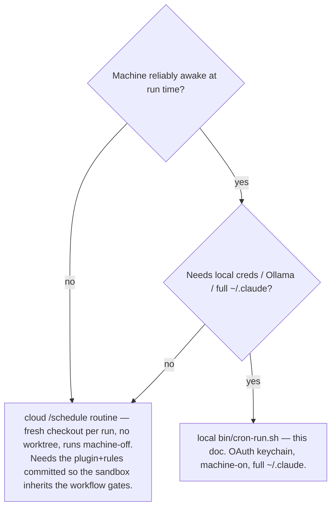

# Scheduled Claude / daemons — `bin/cron-run.sh`

Last updated: 2026-08-16 12:00

Run recurring, unattended work — a docs-freshness sweep, a GitHub-issue triage, an event-triggered
pipeline — by having launchd/cron fire a command inside a **dedicated, self-syncing git worktree**
pinned to `origin/main`. The scheduled job always runs **merged main** code, never whatever branch an
interactive session left the primary checkout on (the shared-checkout drift the `session_start` hook
warns about). Generalizes the dekamer `dekamer-daemon-run.sh` pattern into a template primitive.

## When to use this vs the cloud `/schedule` routine



`bin/cron-run.sh` is the **local** path. The cloud path needs no `cron-run.sh` (each cloud run gets a
fresh checkout, so worktree isolation is free).

## What it does

```
usage: cron-run.sh <cmd> [args...]
  cron-run.sh claude -p "/docs-sweep"        --model claude-opus-4-8
  cron-run.sh claude -p "triage the issues"  --model claude-haiku-4-5-20251001
  cron-run.sh npm run some-daemon            # non-claude caller (dekamer-style)
```

Each run, in order:
1. **Opt-in gate** — silent `exit 0` unless `CRON_ENABLE=1` in `.claude/worktrees.conf`. A
   billed/standing run is never a default.
2. **Self-provision** the worktree at `.claude/worktrees/cron` if absent (launchd never fires the
   `WorktreeCreate` lifecycle hook, so the script does it). No PORT is allocated — batch jobs run no
   dev server.
3. **Sync** — `git fetch` + `git reset --hard origin/main`. **Non-fatal**: a stale run beats a missed
   run, and the tree is dedicated + never human-edited, so the reset can lose nothing.
4. **Conditional deps** — `npm install` only when `SETUP=npm` *and* `package-lock.json` changed.
5. **`exec "$@"`** — role-agnostic.

## Prerequisites

- **`CRON_ENABLE=1`** in `.claude/worktrees.conf` (uncomment it).
- **Auth** — a headless `claude -p` rides your **claude.ai OAuth keychain session** (never `--bare`,
  which refuses OAuth). The launchd/cron environment must be able to reach the login keychain.
- **Model pinning** — when the command is `claude -p`, pin an **exact 4.x** `--model`
  (`claude-opus-4-8` for judgment work like a docs sweep, `claude-haiku-4-5-20251001` for light work
  like triage). A bare alias (`opus`/`haiku`) resolves to Model 5 and trips
  `tests/test_model_routing_audit.sh`. The wrapper is generic and does not inject a model for you.
- **Awake** — launchd does not fire while the Mac is asleep. Prefer a slot the machine is reliably
  awake (a midday run surfaces a failure the same day; an overnight one fails invisibly), or schedule
  a wake (`sudo pmset repeat wake …`).

## Delivery is the prompt's job, not the script's

`cron-run.sh` is delivery-agnostic. How a run hands back work lives in the **prompt**:
- **Docs sweep** → open a PR (never touch `main`): `claude -p "run docs-impact-agent + stamp-docs.sh
  over recent commits; open a PR with the fixes"`.
- **Issue triage** → apply labels / open a summary issue: `claude -p "triage the open issues: label
  each by category"`.

## Example — weekly docs sweep via launchd (macOS)

`~/Library/LaunchAgents/local.<project>.docs-sweep.plist`:

```xml
<?xml version="1.0" encoding="UTF-8"?>
<!DOCTYPE plist PUBLIC "-//Apple//DTD PLIST 1.0//EN" "http://www.apple.com/DTDs/PropertyList-1.0.dtd">
<plist version="1.0">
<dict>
  <key>Label</key><string>local.myproject.docs-sweep</string>
  <key>ProgramArguments</key>
  <array>
    <string>/bin/bash</string>
    <string>/Users/me/Projects/myproject/bin/cron-run.sh</string>
    <string>claude</string>
    <string>-p</string>
    <string>run docs-impact-agent over the last week of commits; open a PR with fixes</string>
    <string>--model</string>
    <string>claude-opus-4-8</string>
  </array>
  <key>StartCalendarInterval</key>
  <dict><key>Weekday</key><integer>1</integer><key>Hour</key><integer>12</integer><key>Minute</key><integer>0</integer></dict>
  <key>RunAtLoad</key><false/>
  <key>StandardOutPath</key><string>/tmp/myproject-docs-sweep.log</string>
  <key>StandardErrorPath</key><string>/tmp/myproject-docs-sweep.log</string>
</dict>
</plist>
```

Install / run-now / uninstall:
```bash
cp local.myproject.docs-sweep.plist ~/Library/LaunchAgents/
launchctl load -w ~/Library/LaunchAgents/local.myproject.docs-sweep.plist
launchctl start local.myproject.docs-sweep          # run once now to verify
tail -f /tmp/myproject-docs-sweep.log
launchctl unload -w ~/Library/LaunchAgents/local.myproject.docs-sweep.plist   # uninstall
```

## See also

`bin/cron-run.sh` (the primitive) · `tests/test_cron_run.sh` (CR-01..CR-04) ·
`.claude/rules/agent-delegation.md` (NEVER-Model-5) · `docs/workflow/HOOKS.md`
(`worktree_create` — the in-session lifecycle this script deliberately replaces for launchd).
