# Overview — how we work, at a glance

Last updated: 2026-08-16 23:44

A single visual atlas of how this project works: the **Design → Code → Prove** workflow it follows,
and where every other doc fits. Each section links to its deep-dive. **The two laws:** _design before
code_ (GATE 1), _evidence before "done"_ (GATE 2) — and before either, _sync the baseline_ (GATE 0).

---

## 1. What this is — three layers, one lifecycle

The same **Design → Code → Prove** workflow applies to **any** stack — web, service/API, CLI/library,
or data. Two layers (Superpowers, native worktrees + the hook layer) compose into
one spine.

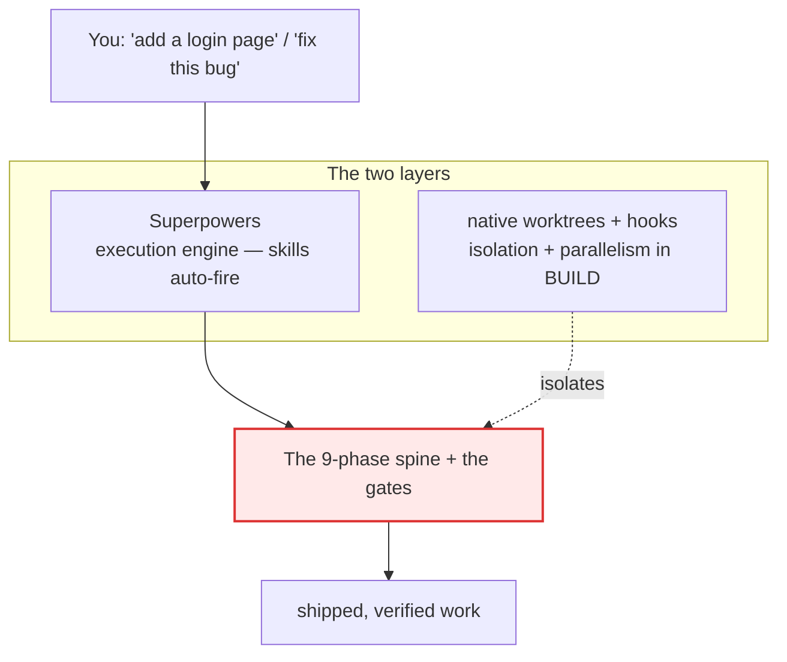

**Zoomed out — the whole machine, end to end.** Entry stamps the workflow in; the runtime carries a
task through the three gates while **hooks** guard every tool call; ship deploys it and `/dev-reflect`
feeds hard-won lessons back to the top of the next loop.

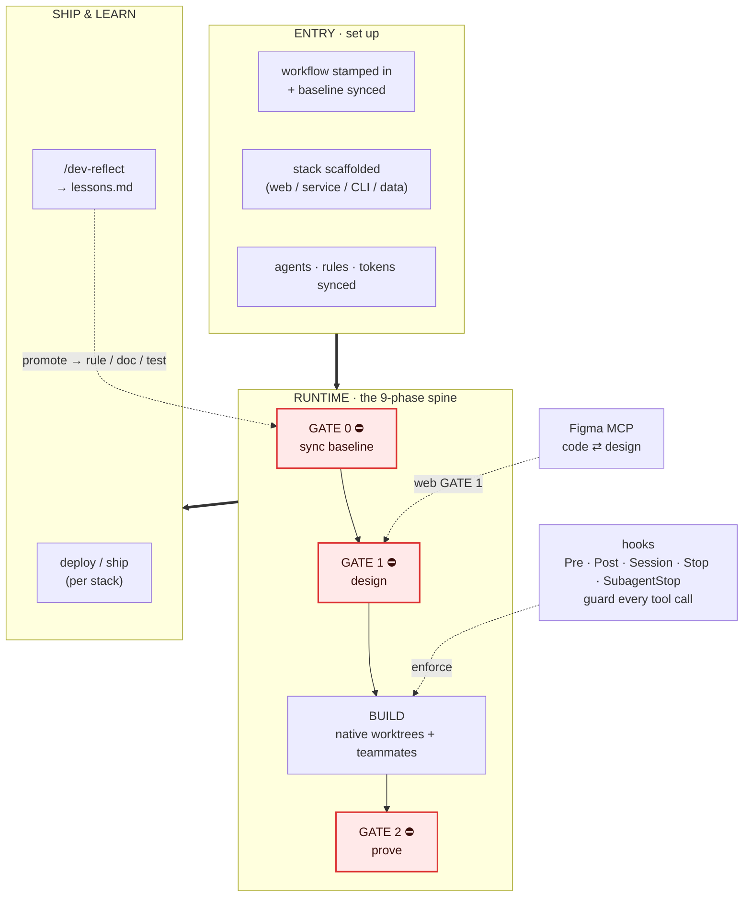

→ Deep dive: [`WORKFLOW.md`](workflow/WORKFLOW.md) · run `/workflow-diagrams` to generate this project's browsable diagram page

The hooks in the diagram above (plus the agents, skills, and rules) ship as a plugin, enabled by one
committed `enabledPlugins` line.

---

## 2. The lifecycle — 9 phases, 3 gates

The spine every task runs through. **GATE 0** (sync), **GATE 1** (design), **GATE 2** (evidence)
are never skipped; trivial changes go inline but GATE 2 still applies.

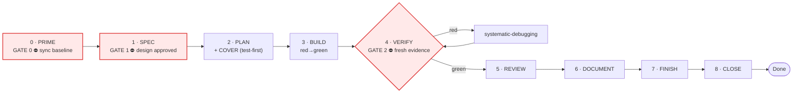

**How much process?** The only thing you decide:

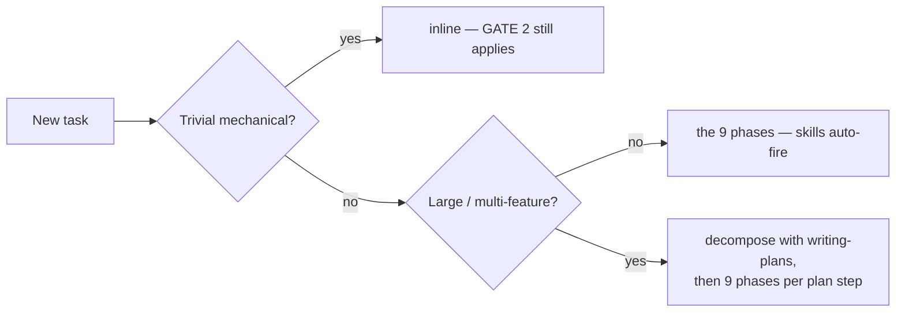

→ [`WORKFLOW.md`](workflow/WORKFLOW.md)

---

## 3. GATE 0 — sync the baseline first

A worktree is a snapshot in time. Build on a stale one and you redo work that already exists.

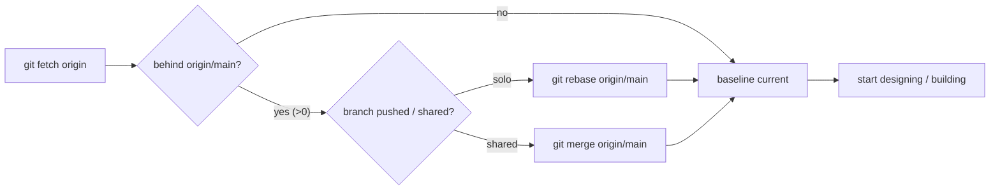

→ [`WORKFLOW.md` § Phase 0](workflow/WORKFLOW.md#phase-0--prime-the-baseline-first)

---

## 4. GATE 1 — design before code

Turn intent into something concrete enough to build without guessing. The spine is universal; only
**MAKE CONCRETE** changes by stack.

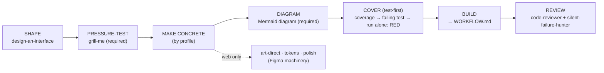

What "concrete enough" means per profile:

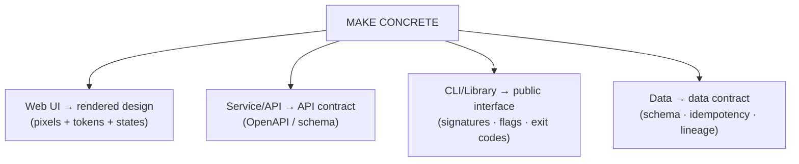

> **Approve the RENDERED design, not the MECHANISM**: pixels for UI, the contract for
> an API, the `--help` for a CLI — before wiring real routes/data.

→ [`DESIGN-WORKFLOW.md`](workflow/DESIGN-WORKFLOW.md)

---

## 5. GATE 2 — evidence before "done"

**RUN it → READ it → CLAIM it.** Green tests ≠ "works" — drive the real artifact too. The pipeline
runs whole, every cycle.

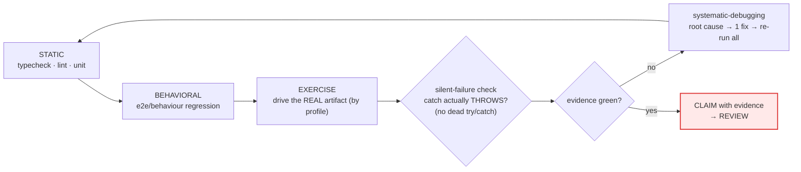

"Drive the real artifact" by profile:

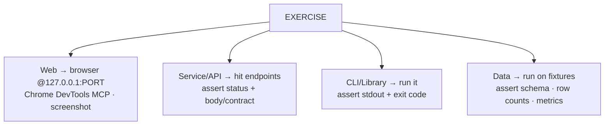

→ [`VERIFY-WORKFLOW.md`](workflow/VERIFY-WORKFLOW.md)

---

## 6. Stack profiles — web is one profile, not the framing

The spine (gates, 9 phases, TDD, worktree isolation) is identical for all. Only VERIFY and GATE 1 vary.

| Profile | GATE 1 "concrete" | GATE 2 "drive the artifact" | Figma |
|---|---|---|---|
| **Web UI** | rendered design + tokens | browser @`127.0.0.1` (Playwright/DevTools) | ✅ |
| **Service / API** | API contract / schema | hit endpoints, assert status+body | ❌ |
| **CLI / Library** | interface (flags, exit codes) | run it, assert stdout + exit code | ❌ |
| **Data / Pipeline** | data contract / schema | run on fixtures, assert output | ❌ |

Set per project in `.claude/worktrees.conf` → `STACK_PROFILE`.
→ [`WORKFLOW.md` § profile table](workflow/WORKFLOW.md#exercise-the-real-artifact-by-profile)

---

## 7. Native worktrees + hooks — isolation & parallelism

Native worktrees (`EnterWorktree`, or the Agent tool's `isolation: worktree` for parallel writers),
provisioned by the `worktree_create` hook (fetch · env carry-in · setup · a collision-free PORT in
`.claude/worktree.env`), with a per-repo test lock (`bin/test-lock`).

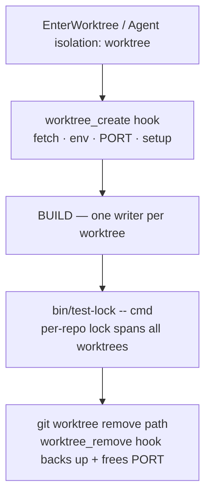

Teammates are in-process Agent-tool spawns coordinated via SendMessage; the `teammate_idle` hook
keeps a teammate working while it still owns tasks:

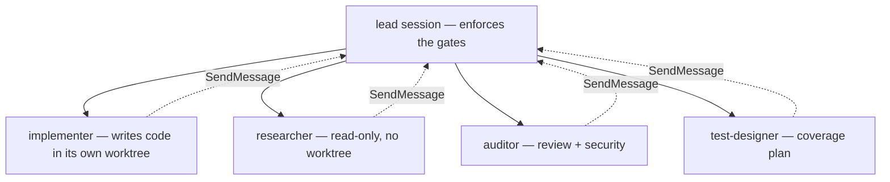

Always run suites via `bin/test-lock -- <cmd>` (holds the lock; the `test_lock_enforce` hook
denies raw suite runs).

**Optional — RTK output compression.** An opt-in (OFF by default) CLI proxy that compresses noisy
command output before it reaches the LLM. Instruction-based (no PreToolUse hook at project scope),
telemetry forced off, and the H1–H10 guards still fire on its `rtk `-prefixed commands.
→ [`RTK.md`](RTK.md)

**Optional — Scheduled runs via `bin/cron-run.sh`.** An opt-in (OFF by default) wrapper that runs
recurring, unattended work (`claude -p` prompts or a plain daemon) in a dedicated, self-syncing git
worktree pinned to `origin/main` via launchd/cron — a scheduled job always runs merged main code,
never whatever branch an interactive session left the primary checkout on. Enable with
`CRON_ENABLE=1` in `.claude/worktrees.conf`. → [`CRON.md`](CRON.md)

---

## 8. Figma — two directions, official paths only

Figma work goes through the **official Figma MCP** (code → Figma via `use_figma`, Figma → code via
`get_design_context`) and **claude-in-chrome** (the `window.figma` browser API, quota-free).

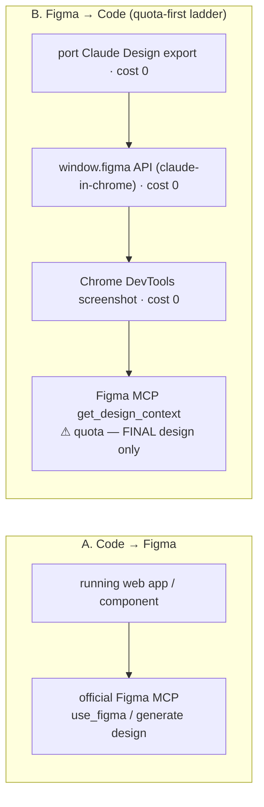

> GATE 1 still applies: approve the rendered design before wiring data.

→ _(web projects only)_ [`FIGMA-UI.md`](FIGMA-UI.md)

---

## 9. Agents & delegation — one per phase

Delegate substantial work to in-process subagents; trivial things stay inline.

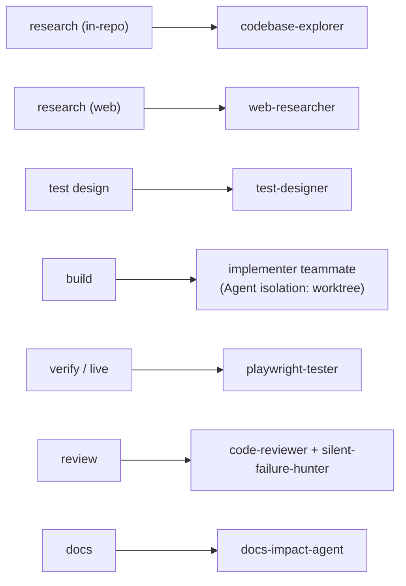

→ `.claude/rules/agent-delegation.md` (@imported per project by CLAUDE.md's Conventions block)

---

## 10. Lessons loop — capture what bit you

Hard-won lessons are appended to `docs/lessons.md` by `/dev-reflect` at CLOSE, then promoted to a
durable home (a rule, a doc, a test) so they enforce themselves next time. CLOSE also files
follow-ups / known gaps / deferred nits as GitHub issues (`gh issue create`) — a blocking Stop hook
(`close_issue_gate`) enforces this for any session that made a commit, unless it states
`WORKFLOW:no-follow-ups`.

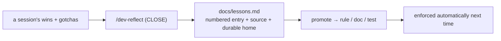

→ [`lessons.md`](lessons.md)

---

## Doc map — which page when

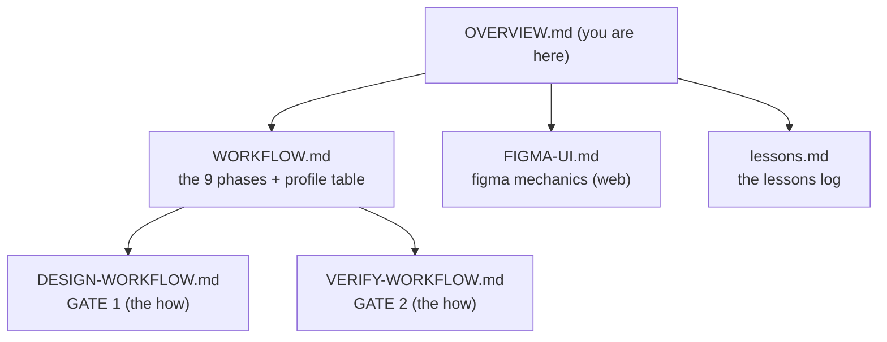

| Doc | Read it when |
|---|---|
| [`WORKFLOW.md`](workflow/WORKFLOW.md) | new here, or the canonical 9-phase workflow + stack profiles |
| [`DESIGN-WORKFLOW.md`](workflow/DESIGN-WORKFLOW.md) | satisfying GATE 1 (idea → approved design) |
| [`VERIFY-WORKFLOW.md`](workflow/VERIFY-WORKFLOW.md) | satisfying GATE 2 (proving it works) |
| [`FIGMA-UI.md`](FIGMA-UI.md) _(web)_ | Figma-MCP mechanics, quota strategy |
| [`lessons.md`](lessons.md) | the hard-won lessons log |
| `/workflow-diagrams` | run this command to generate this project's browsable page of every committed Mermaid diagram, by topic |
