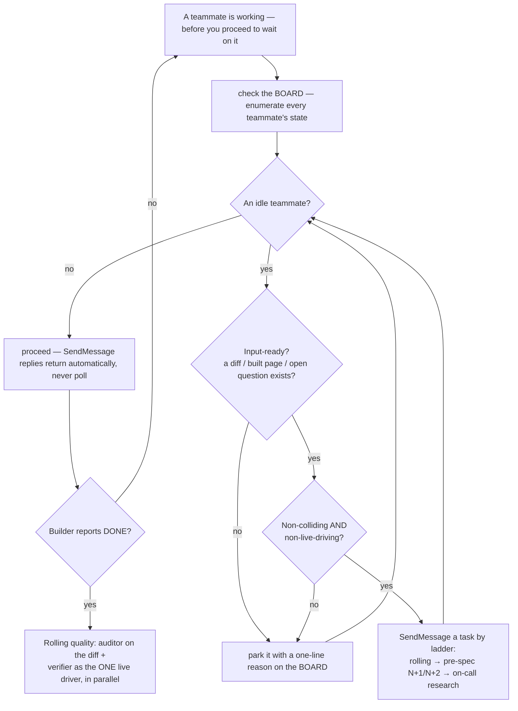
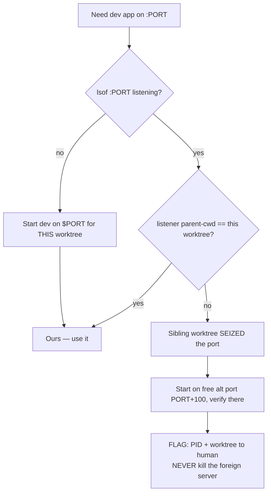
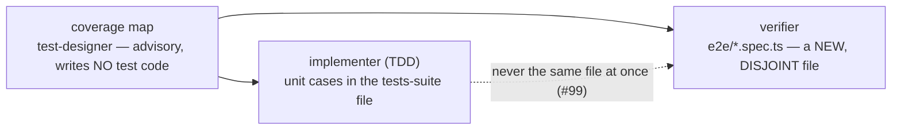
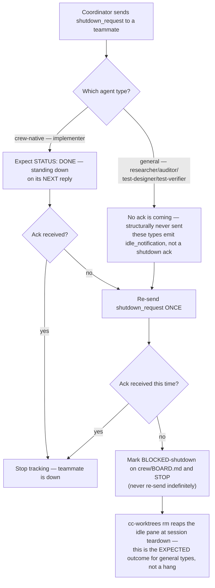

# Crew workflow guardrails

Decision diagrams that turn a `cc-worktrees` crew session's recurring frictions into **branch logic**.
A retrospective lesson in [`lessons.md`](lessons.md) records *what* went wrong; the diagram below makes
the failure mode structurally hard to repeat. These are **crew-mechanism** guardrails — they apply when
a crew is running (one coordinator pane driving Agent-tool teammates over SendMessage). They
complement the coordinator's own methodology (`write_coordinator_prompt` in
[`../bin/cc-worktrees`](../bin/cc-worktrees), generated into `crew/prompts/coordinator.md`) and the
shared per-worker methodology (`_crew_methodology`, same file). The universal spine stays in
[`WORKFLOW.md`](WORKFLOW.md) / [`VERIFY-WORKFLOW.md`](VERIFY-WORKFLOW.md).

Inline Mermaid is canonical here (the repo's docs convention — no committed images).

| Guardrail | Encodes |
|---|---|
| No idle teammate — fill or park before you wait | no-idle-wait / idle-triage / one-live-driver / autonomy-contract |
| Dev-port ownership across worktrees | #103 |
| Test-ownership partition at P3 | #99 |
| Shutdown handshake by agent-type | #156 |

---

## No idle teammate — fill or park before you wait

This is the decision-diagram restatement of the **no-idle-wait / idle-triage** discipline; the
authoritative version is ENCODED IN the coordinator methodology (`write_coordinator_prompt` →
`crew/prompts/coordinator.md`) — this doc is the human-facing diagram, NOT a competing authority.

**★ HARD GATE.** Letting a teammate sit idle with ready work while you wait on another is a GATE
VIOLATION on par with GATE-1/GATE-2 — the #1 coordinator failure. In crew replies return
automatically (SendMessage — never poll), so "waiting" means *proceeding while a teammate works*:
before you settle into that, check the BOARD and, for EVERY idle teammate, SendMessage its next
input-ready / non-colliding / non-live-driving task — or explicitly **park** it with a one-line reason
on the BOARD.

**IDLE-FILL LADDER** — per idle teammate, assign the FIRST applicable: **rolling** (audit/verify the
last diff) → **pre-spec N+1/N+2** (research / test-design the next units) → **on-call research** (an
open data/surface question) → **park** (none apply — park with a reason; idle is not silent — surface
the pull-based report trail).

Encodes the **no-idle-wait** hard gate, **idle-triage** (only input-ready, non-colliding,
non-live-driving work), **one-live-driver** (only one teammate drives the live app at a time), and
**idle ≠ silent** (surface the pull-based report trail so a finished teammate never looks stuck).

**AUTONOMY CONTRACT.** The coordinator runs autonomously; the ONLY three sanctioned human pauses are
(a) **GATE-1 design sign-off**, (b) **cannot-converge** — GATE-2 still red after a bounded retry
budget, and (c) a genuine **scope fork** / destructive op / missing credential. Everything else
proceeds and reports — no "is this ok?" round-trips.

---

## Dev-port ownership across worktrees

Run multiple worktrees/crews in parallel and two dev servers default to the same port; the second to
start can **seize** it, so `:PORT` silently serves the *other* worktree's app — verification then asserts
against the wrong codebase (a 404 on a route only your branch has). Detect by IDENTITY (the listener's
parent-cwd), verify on your OWN free port, and FLAG — the naive "kill whatever's on the port" clobbers a
concurrent human session.

Encodes **#103** (a sibling worktree can seize your dev port — detect by identity, verify on your own
port, flag never clobber).

---

## Test-ownership partition at P3

When the implementer (TDD) and the verifier both produce tests, split by file so they never collide:

Encodes **#99** (partition test ownership by file — `git diff --name-only` confirms zero overlap;
extends the single-code-owner rule to the test layer).

**N instances of a role (#162/#163) are the same invariant one level up** — multiple writers,
disjoint FILES becomes multiple implementers, disjoint WORKTREES. Count writers, not agents: N
read-only auditors can share a worktree (two lenses on one diff is diversity, not duplication);
every extra implementer gets its own worktree, provisioned by the coordinator with
`cc-worktrees add` (never by the teammate — the create default spawns a whole crew). The
coordinator names each instance's result file (`crew/<role>-<slug>.md`) and diff range in every
assignment, and serializes merges (fresh PR for post-merge follow-ups; `merge-base --is-ancestor`
on every "pushed" claim).

---

## Shutdown handshake — crew-native ack vs general idle-out

Only ONE of the 5 worker roles is a **crew-native** agent type built specifically for this
methodology; the other 4 map to **general** subagent types that were never built to speak the
`shutdown_request` → ack protocol at all. A coordinator that waits for an ack from a general type
would wait forever — this is the failure mode lesson #156 records.

| Crew role | `subagent_type` | Sends a shutdown ack? |
|---|---|---|
| `implementer` | `crew-implementer` (crew-native) | **Yes** — `STATUS: DONE — standing down` |
| `researcher` | `codebase-explorer` (general) | No — emits `idle_notification` instead |
| `auditor` | `code-reviewer` (general) | No — emits `idle_notification` instead |
| `test-designer` | `test-designer` (general) | No — also has no Bash tool, can't even BOARD-append |
| `test-verifier` | `playwright-tester` (general) | No — emits `idle_notification` instead |

**Decision note:** don't treat a second no-ack as an anomaly to debug — for 4 of the 5 roles it's
the *only possible* outcome, by construction. The re-send-once-then-BLOCKED-then-STOP rule already
in the coordinator's own methodology (`_crew_coordinator_methodology`, `bin/cc-worktrees`) is
sufficient; the fix here is purely in the REASONING each side carries, not new mechanics — the
worker-side tail (`_crew_methodology`) is now role-conditional (only `implementer` gets the ack
instruction; the other 4 are told plainly they don't need to send one), and the coordinator-side
text now states explicitly *why* a second no-ack is expected rather than alarming for those roles.
