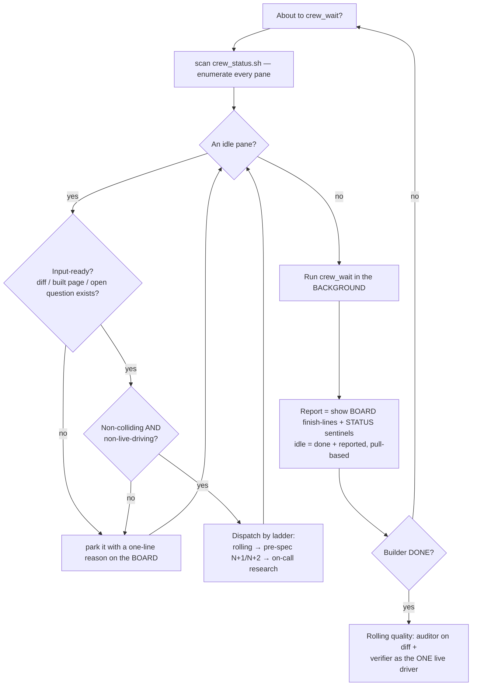
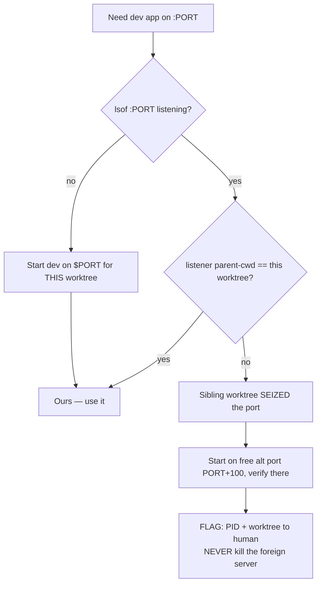
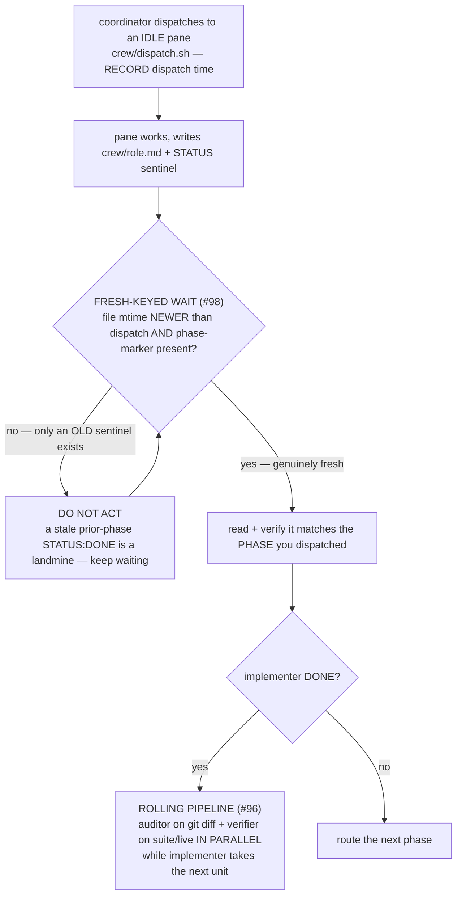
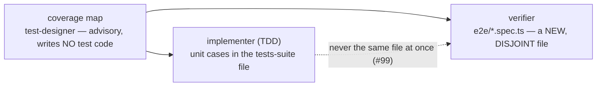

# Crew workflow guardrails

Decision diagrams that turn a `cc-worktrees` crew session's recurring frictions into **branch logic**.
A retrospective lesson in [`lessons.md`](lessons.md) records *what* went wrong; the diagram below makes
the failure mode structurally hard to repeat. These are **crew-mechanism** guardrails — they apply when
a multi-pane crew is running, and live alongside the coordinator methodology in
[`../bin/cc-worktrees`](../bin/cc-worktrees) (`_crew_methodology`). The universal spine stays in
[`WORKFLOW.md`](WORKFLOW.md) / [`VERIFY-WORKFLOW.md`](VERIFY-WORKFLOW.md).

Inline Mermaid is canonical here (the repo's docs convention — no committed images).

| Guardrail | Encodes |
|---|---|
| D1 · Coordinator dispatch loop | #107 NO-IDLE-WAIT hard gate · #108 autonomy contract · #96 idle-pane triage · #103 one live driver · #105 pull-based reporting |
| D2 · Dev-port ownership across worktrees | #103 |
| Dispatch & fresh-keyed wait | #98 |
| Test-ownership partition at P3 | #99 |

---

## D1 — Coordinator dispatch loop  _(pane-transport specific — send-keys artifacts; N/A for team-v2's SendMessage-coordinated teammates (separate OS processes, not in-process — see CC-WORKTREES.md § Team-v2 for the lifecycle))_

**★ HARD GATE — NO IDLE WAIT (#107).** Blocking on one pane while another idle pane has ready work is a
**GATE VIOLATION** on par with GATE-1/GATE-2 — the #1 coordinator failure. *Before you run any `crew_wait`*
(foreground OR background) you MUST first scan `crew_status.sh` and, for EVERY idle pane, dispatch its next
input-ready / non-colliding / non-live-driving task — or explicitly `park` it with a one-line reason on the
BOARD. The coordinator must neither leave every other pane idle (wasted parallelism) nor "keep them busy"
by dispatching every phase at once — a reviewer with **no diff** or a verifier pointed at the **builder's
live server** is worse than idle.

**IDLE-FILL LOOP — the per-tick priority ladder** the hard gate enforces (after every dispatch AND before
every wait), for each idle pane assign the FIRST applicable: **`rolling`** (audit/verify the last diff) →
**`pre-spec N+1/N+2`** (research / test-design the next units) → **`on-call research`** (answer an open
data/surface question) → **`park`** (none apply: park with a one-line reason — idle ≠ silent, #105).

Encodes **#107** (NO-IDLE-WAIT hard gate — fill or park every idle pane *before* you wait; blocking-while-idle
is a GATE VIOLATION), **#96** (idle-pane triage — only input-ready, non-colliding, non-live-driving phases),
**#103** (one live driver at a time), and **#105** ("idle" ≠ "silent" — render the pull-based report trail).

**AUTONOMY CONTRACT (#108).** The coordinator runs autonomously; the ONLY three sanctioned human pauses are
(a) **GATE-1 design sign-off**, (b) **cannot-converge** — GATE-2 still red after a bounded retry budget, and
(c) a genuine **scope fork** / destructive op / missing credential. Everything else proceeds and reports —
no "is this ok?" / "should I proceed?" round-trips.

---

## D2 — Dev-port ownership across worktrees

Run multiple worktrees/crews in parallel and two dev servers default to the same port; the second to
start can **seize** it, so `:PORT` silently serves the *other* worktree's app — verification then asserts
against the wrong codebase (a 404 on a route only your branch has). Detect by IDENTITY (the listener's
parent-cwd), verify on your OWN free port, and FLAG — the naive "kill whatever's on the port" clobbers a
concurrent human session.

Encodes **#103** (a sibling worktree can seize your dev port — detect by identity, verify on your own
port, flag never clobber).

---

## Dispatch & fresh-keyed wait  _(pane-transport specific — send-keys artifacts; N/A for team-v2's SendMessage-coordinated teammates (separate OS processes, not in-process — see CC-WORKTREES.md § Team-v2 for the lifecycle))_

The crew-ops failure: a pane reused one result file across P3→P4, and the wait matched the **stale P3
sentinel** and returned instantly — nearly reporting P4 "done" off an old line. The guard: wait until the
file's **mtime is newer than the dispatch** AND a **phase-marker** is present; only then read + verify it
matches the dispatched phase. A sentinel is fresh only if the file changed AFTER you asked. The
`crew_wait.sh` helper enforces this via `CREW_WAIT_SINCE` (mtime) + `CREW_WAIT_GREP` (phase marker).

Encodes **#98** (fresh-keyed wait — never act on a stale prior-phase `STATUS: DONE`).

---

## Test-ownership partition at P3

When the implementer (TDD) and the verifier both produce tests, split by file so they never collide:

Encodes **#99** (partition test ownership by file — `git diff --name-only` confirms zero overlap;
extends the single-code-owner rule to the test layer).
