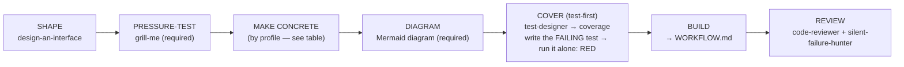
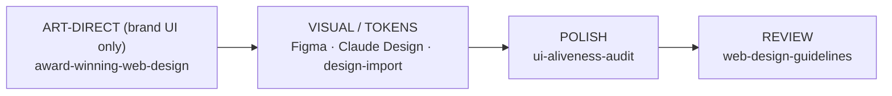
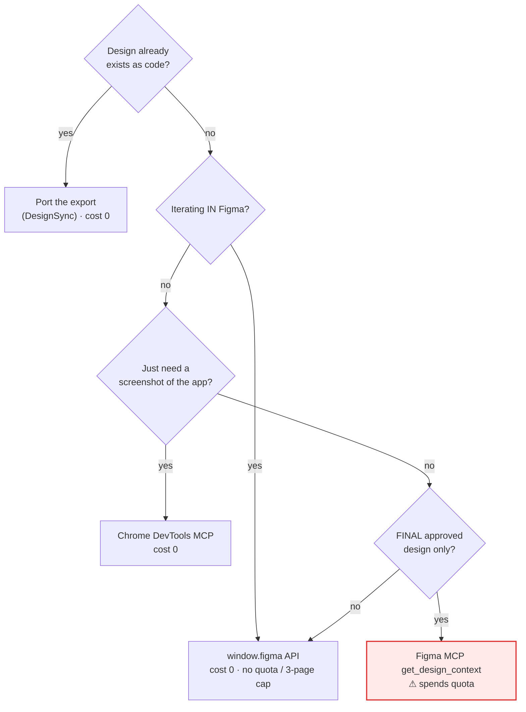

# Design Workflow (the _how_ of GATE 1)

Last updated: 2026-08-14 12:55

> Companion to `rules/design-workflow.md` — no auto-sync; edit both by hand.

The Design leg of **Design → Code → Prove** (`WORKFLOW.md`). This is _how_ you satisfy
GATE 1 — turn intent into a concrete, approved design before any implementation. A
`CLAUDE.md` instruction still wins, and the gate is never skipped. A design is **approved**
when shape + tokens + key states are concrete enough to build without guessing — the sharpest,
executable form of that bar is **you can write a RED test against the contract** (the COVER step
below). Then `WORKFLOW.md` BUILD → VERIFY takes over. Run the stages that fit; skip what doesn't.

## The design pipeline (universal spine)

The spine is the same for every stack; the **MAKE CONCRETE** step is the only thing that changes by
profile (and only the Web-UI profile needs the visual machinery in the next section).

- **SHAPE** — `design-an-interface` ("Design It Twice": 3+ radically different designs, compared on simplicity/depth/misuse-resistance) → the chosen interface shape. This is the strongest fit for CLI/library/API work, where the "interface" _is_ the deliverable.
- **PRESSURE-TEST** *(required — never skip)* — `grill-me` → severity-tiered flaws surfaced. **Fold every finding back into
  the plan/design doc before moving on** — a flaw noted in the grill-me transcript but never
  incorporated into the actual design didn't happen; the doc, not the conversation, is what SHAPE
  hands to BUILD. Fixed _before_ you commit to a direction.
- **MAKE CONCRETE** — turn the chosen shape into something concrete enough to build without guessing:

  | Profile | "Concrete enough to build" means | Skills / artifacts |
  | --- | --- | --- |
  | **Web UI** | a rendered design — shape + tokens + key states, signed off on the actual pixels | the [Web-UI design pipeline](#web-ui-profile--art-direction-visual--tokens) below |
  | **Service / API** | the API contract — endpoints, request/response schemas, error shapes, status codes | OpenAPI / schema doc; example request/response pairs |
  | **CLI / Library** | the public interface — signatures, flags/args, exit codes, error types | the `design-an-interface` output; a usage/`--help` sketch |
  | **Data / Pipeline** | the data contract — input/output schema, partitioning, idempotency, lineage | schema doc; sample-in → sample-out fixtures |

- **DIAGRAM** *(required)* — the design must include a **Mermaid diagram** of the approach (flow / state machine / architecture / interface) in the design doc/spec. It's picked up at CLOSE when `/workflow-diagrams` refreshes the project's diagram page.
- **COVER (test-first)** *(the executable proof the design is buildable)* — turn the concrete contract into a **red test** before any production code. Two sub-parts:

  1. **coverage** — `test-designer` maps the contract's behaviours / state-transitions → a coverage doc (Mermaid for stateful flows, checklist table otherwise). Advisory; no test code yet.
  2. **failing test** — write the behaviour test(s) that encode that coverage (profile-matched — see the table below), then **run JUST that new test on its own** (`bin/test-lock -- <only this test>`) **to confirm it fails RED for the RIGHT reason** — an assertion / 404 / not-implemented, _not_ a syntax error or missing import. Run ONLY the new test, not the whole suite — the rest of the suite stays **green**; only this one test is **red**.

  > ⚠ Do **not** run `/validate` here. `/validate` is the **full-suite GREEN gate** at VERIFY (`WORKFLOW.md` P4); a whole-suite run at COVER would just fail on the single test you deliberately made red. The red test is the executable form of the contract; it hands to BUILD so BUILD is genuinely **red→green**.

  | Profile | The failing test is… |
  | --- | --- |
  | **Web UI** | an `e2e/*.spec.ts` against the approved flow (`playwright-tester`), red because the feature is unbuilt |
  | **Service / API** | an integration test hitting the contract endpoints, red (404 / not-implemented) |
  | **CLI / Library** | a golden / signature test against the public interface, red |
  | **Data / Pipeline** | a fixture test (sample-in → sample-out), red |

- **BUILD** — domain skills (web: `frontend-design`) → production code that turns the COVER red test green. _(Hand-off: `WORKFLOW.md` BUILD → VERIFY ⛔ now owns it.)_
- **REVIEW** — the panel, dispatched **CONCURRENTLY — all four in ONE message**: **required** `code-reviewer` (= `/code-review`, owns the verdict) + `silent-failure-hunter`; **advisory** `code-simplifier` + `comment-analyzer` (one comment); `/security-review` (distinct); web also `web-design-guidelines`. **If the panel changes code, re-run VERIFY before merge.**

---

## Web-UI profile — art direction, visual & tokens

> _This whole section applies to the **Web UI** profile only._ Service/API, CLI/library, and data
> projects satisfy GATE 1 at "MAKE CONCRETE" above (a contract / interface / schema) and skip
> straight to BUILD — there are no pixels to approve.

The Web-UI MAKE-CONCRETE step has its own sub-pipeline:

- **ART-DIRECT** _(premium/brand sites only)_ — `award-winning-web-design` → a `concept.md` with real tokens + motion specs. Internal tools skip this.
- **SOURCE A LOOK / TOKENS** _(optional)_ — `design-import` (lift an existing site → tokenized HTML + React + `IMPORT.md`), **or** port a claude.ai/design / Figma-Make export, **or** pull tokens from Figma (table below).
- **POLISH** — `ui-aliveness-audit` → micro-feedback, loading/empty states, motion. **Every animation reduced-motion-gated.**

> **GATE-1 approves a RENDERED design, not a MECHANISM.** "Build frame 2:4 / mirror `DossierCard`" is a
> _build instruction_, not an approved look — building straight from it produces "that's not the design"
> reversals. Render the design to a **dev-only gated preview** (e.g. `/design-preview/<name>`),
> **screenshot desktop + mobile**, and get explicit human sign-off on _those pixels_ **before** wiring real
> routes/data. Approving a mechanism ≠ approving a design. _(Web-UI only — the analogue for an API is
> "approve the contract, not the handler"; for a CLI, "approve the `--help`, not the parser.")_

### Figma / Claude Design — quota-free first

**Never spend the Figma MCP quota (≈6 calls/month on Starter) on iteration — only on the final, approved design.** Ranked free → paid:

| Path                                                                                                   | Cost      | Fidelity                  | Use when                                                                                   |
| ------------------------------------------------------------------------------------------------------ | --------- | ------------------------- | ------------------------------------------------------------------------------------------ |
| **Port a Claude Design / Figma-Make export** (`DesignSync get_file` the React export → serve → render) | **0**     | exact (it _is_ code)      | the design already exists as code — the most faithful path                                 |
| **`window.figma` browser API** (`mcp__claude-in-chrome__javascript_tool`, logged-in tab)               | **0**     | exact (native plugin API) | iterating in Figma — bypasses the 6/month quota **and** the 3-page cap, unlimited          |
| **Chrome DevTools MCP / Playwright** (own browser, `http://127.0.0.1:PORT`)                            | **0**     | exact render              | screenshotting the live app — immune to the blocked extension (the `claude-template:local-browser-testing` plugin skill) |
| **`html.to.design`** plugin (incl. localhost extension)                                                | **0**     | ~70-80%                   | bootstrap a running site → editable Figma layers for review                                |
| **Figma MCP `get_design_context` / `get_variable_defs`**                                               | **quota** | 95%+ semantic             | one-shot codegen / token-sync from the FINAL design (unlimited on a Dev seat)              |

Pick the cheapest path that hits the fidelity you need — only the **final, approved** design earns the quota:

Direction: `get_design_context` reads **Figma → code**; `use_figma` / `figma-generate-design` go **code → Figma**. Don't confuse them. The design-sync push flow sends a repo design system **into** claude.ai/design (external claude.ai/design flow — no local slash command; separate from reading a project via `DesignSync`).

> **The _how_ of this leg → `FIGMA-UI.md`.** When VISUAL/TOKENS means driving Figma — the official
> Figma MCP (quota-metered) plus the quota-free claude-in-chrome `window.figma` path, and
> **Code Connect** (the highest-value lever to try first) — `FIGMA-UI.md` is the playbook; the
> `figma-ui` skill the per-change checklist.

## Skill interview convention (before/after-skill feedback lifecycle)

A skill that takes arguments (a choice-y `argument-hint`) shouldn't fire blind — it runs an **interview
before** and a **questionnaire after**:

- **`## Interview` (BEFORE_SKILL)** — an optional `## Interview` block in the `SKILL.md`, **≥4
  `AskUserQuestion` prompts, one at a time**, run at skill start to resolve choice-y inputs. The
  `skill_nudge` PostToolUse hook WARNs when a choice-taking `SKILL.md` lacks it (nudge only). Author via
  `superpowers:writing-skills`.
- **`/to-questionnaire` (AFTER_SKILL)** — after the skill finishes, run mattpocock `to-questionnaire`
  (or `/questionnaire-me`) to capture any decision it surfaced-but-couldn't-resolve as an async Markdown
  questionnaire. Lifecycle: **BEFORE_SKILL (interview) → SKILL_EXECUTION → AFTER_SKILL (`/to-questionnaire`)**.

Also at COVER: the acceptance test is **binary (1/0) and authored BEFORE the plan** — `writing-plans`
targets a concrete pass/fail, and the plan doc names the test.

## See also

`FIGMA-UI.md` (Figma-MCP mechanics of VISUAL/TOKENS → BUILD) · the `figma-ui` skill (per-change checklist) · `agent-delegation.md` (delegate the parallel design exploration to subagents) · the `claude-template:local-browser-testing` plugin skill (`127.0.0.1`, never the blocked Claude-in-Chrome extension) · `/questionnaire-me` + mattpocock `to-questionnaire`/`grilling`.
