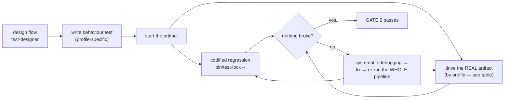
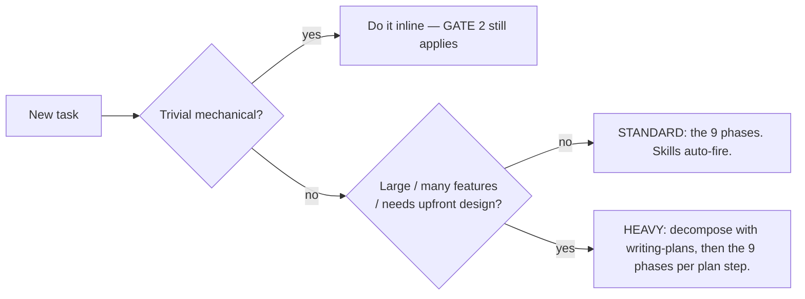
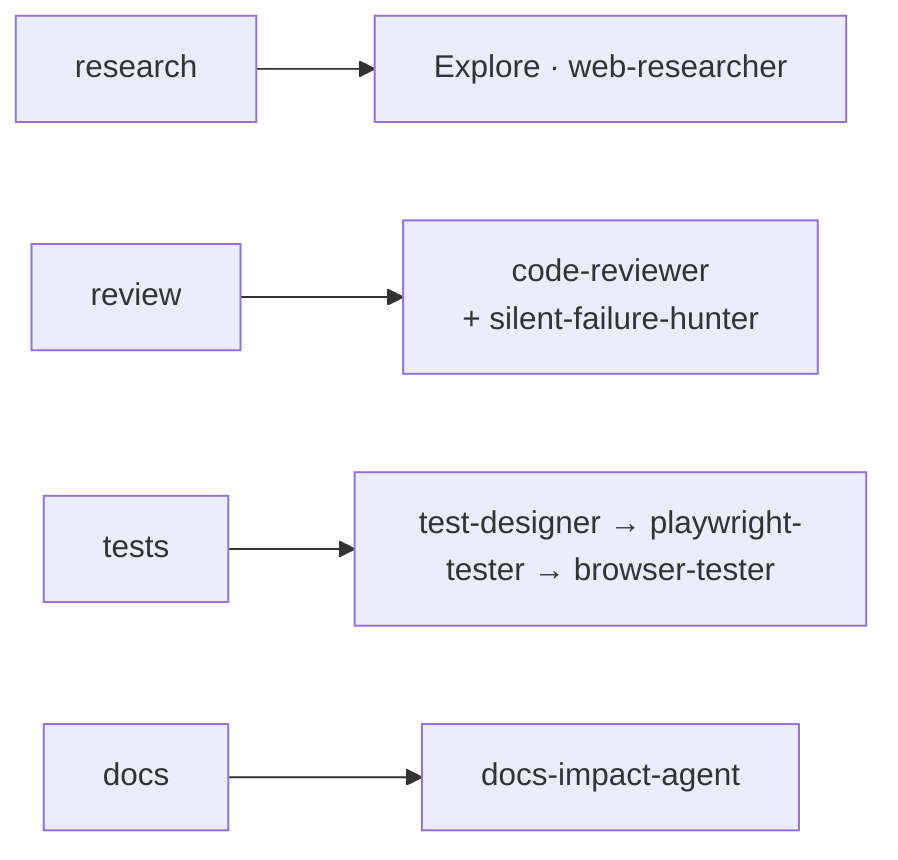

# Canonical Workflow

Last updated: 2026-08-16 13:00

> **THE LAW — Design → Code → Prove.** Shape it before you build it (GATE 1 ⛔), prove it
> with fresh evidence before you call it done (GATE 2 ⛔). Two hard gates, never skipped.
> The _how_ of the Design and Prove legs lives in `DESIGN-WORKFLOW.md` / `VERIFY-WORKFLOW.md`.

One workflow, every project — **any stack**. The discipline below is universal; the only thing
that changes by stack is _how you drive the real artifact_ (a web UI, a service/API, a CLI/library,
a data pipeline) — see the [profile table](#exercise-the-real-artifact-by-profile). Two layers
compose into a single lifecycle:

- **Superpowers** — the execution engine. Its skills auto-trigger (via the plugin's
  `SessionStart` hook) and enforce the discipline. You rarely invoke them by name. Large features
  decompose with `writing-plans` (brief → plan → per-step BUILD).
- **Native worktrees + the hook layer** — isolation & parallelism for the BUILD phase
  (`EnterWorktree` / Agent-tool `isolation: worktree`, provisioned by the `worktree_create` hook)
  plus `bin/test-lock` for suite serialization.

Two laws override everything: a **`CLAUDE.md` instruction beats any skill**, and the **HARD GATES**
are never skipped.

> **Dev workflow vs. product/user workflow — don't conflate them.** *This* document is the **universal
> DEV workflow** (Design → Code → Prove) — it applies to every stack, including this template itself.
> The **product/user workflow** — *what an end user does in the thing you're building* — is a separate,
> project-specific artifact and the SOURCE that feeds P2 test-design: for **web** projects it's a
> user-flow doc (the user journeys); for **CLI/library** projects it's the
> subcommands/public interface; for a **service** it's the API contract. Keep that artifact current —
> the dev workflow proves you built it right; the user-flow doc says what "it" is.

- **GATE 0 — Baseline before anything.** No design or code until you've synced to the current
  source of truth THIS session: **invoke `superpowers:using-superpowers`** (load the skill engine) first, then
  `git fetch`, check the behind-count vs `main`, **rebase if behind**,
  and diff the live/deployed artifact (not a stale local snapshot). A feature branch is a snapshot in
  time — build on a stale one and you redo work that already exists. **Verify the plan/brief premise
  too**, not just the git base: have research characterize the target against live code and emit a
  `[EXISTS]/[PARTIAL]/[MISSING]` + file:line gap list; if it already exists, re-scope and re-enter
  GATE 1. A spawning plan is a hypothesis to falsify, not a contract. See [Phase 0](#phase-0--prime-the-baseline-first).
- **GATE 1 — Design before code.** No implementation until an approved design exists
  (`brainstorming`; large work decomposes with `writing-plans`).
- **GATE 2 — Evidence before "done".** No "done / fixed / passing" claim without FRESH
  output THIS turn — unit tests, typecheck, lint, AND the behaviour tests run against the
  **real artifact** (`verification-before-completion` + `/validate`; drive the real artifact via the
  `run`/`webapp-testing` skills — no slash command). **SHOW the evidence
  in your report** — surface what proves it (screenshot for UI · response body for API · stdout/exit
  for CLI · output rows for data); evidence the user can't see is half-wasted.

## The 9 phases

```mermaid
flowchart TD
    P0["0 · PRIME — GATE 0 ⛔<br/>read docs/workflow/WORKFLOW.md · invoke superpowers:using-superpowers<br/>git fetch · behind-count vs main · rebase if behind<br/>diff the LIVE artifact · gh issue list (dup check) · /rc (concurrent-session check) · /prime-core · /project-status"] --> G0
    G0{"GATE 0+ ⛔ — is the plan/brief premise still TRUE vs live code?<br/>research confirms what already exists (gap list)"}
    G0 -->|"stale — already built / wrong scope"| RS["RE-SCOPE<br/>narrow to the REAL gap · re-enter GATE 1"]
    RS --> P1
    G0 -->|"current"| P1
    P1["1 · SPEC — GATE 1 ⛔<br/>brainstorming auto · grill-me (required)<br/>Mermaid diagram of the design (required)<br/>design doc → docs/superpowers/specs/"] --> P2
    P2["2 · PLAN + COVER (test-first)<br/>writing-plans auto → docs/superpowers/plans/<br/><b>test-designer</b> → coverage (Mermaid + checklist)<br/>write the FAILING test · run it alone → RED"] --> P3
    P3["3 · BUILD (red→green)<br/>native worktree (WorktreeCreate hook provisions)<br/>TDD auto · make the COVER test green<br/>domain skills (web: frontend-design · skill-authoring: superpowers:writing-skills)<br/>run the app/tool (<set RUN_CMD in .claude/worktrees.conf>)"] --> P4
    P4{"4 · VERIFY — GATE 2 ⛔ — regression, EVERY cycle<br/>bin/test-lock -- <set TEST_CMD in .claude/worktrees.conf> (unit + behaviour)<br/>drive the REAL artifact (by profile — see below)<br/>typecheck · lint · /validate · run/webapp-testing skills"}
    P4 -->|"red"| DBG["systematic-debugging auto"]
    DBG --> P4
    P4 -->|"green + artifact-verified"| P5["5 · REVIEW — /pr-open auto-dispatches panel + docs-impact<br/>code-reviewer + silent-failure-hunter (req)<br/>+ code-simplifier + comment-analyzer (advisory) · /security-review"]
    P5 -->|"panel changed code"| P4
    P5 --> P6["6 · DOCUMENT (impact)<br/><b>docs-impact-agent</b> → what did this change make STALE?<br/>update docs/ (ARCHITECTURE · README · TESTING) · /write"]
    P6 --> P7["7 · FINISH<br/>finishing-a-development-branch auto<br/>git worktree remove (WorktreeRemove hook backs up) · /merge-prs"]
    P7 --> P8["8 · CLOSE (docs-CLOSE) — GATE ⛔<br/>file follow-ups as GitHub issues or WORKFLOW:no-follow-ups<br/>HANDOFF/TASKS ← real PR#/merge state<br/>/handoff · /dev-reflect → docs/lessons.md<br/>/workflow-diagrams (best-effort)"]
    P8 --> Done([Done])
```



## Phase → tools

| #   | Phase               | Drives it (auto)                                                              | Commands / tools                                                                                                                                                                    |
| --- | ------------------- | ----------------------------------------------------------------------------- | ----------------------------------------------------------------------------------------------------------------------------------------------------------------------------------- |
| 0   | PRIME ⛔            | —                                                                             | **read `docs/workflow/WORKFLOW.md` first · invoke `superpowers:using-superpowers`** · **sync baseline first** (`git fetch` · behind-count vs `main` · rebase if behind) · **verify the plan premise vs live code** (gap list) · `gh issue list` (already tracked? avoid dup work) · **`/rc` (concurrent-session check — is another session already on this project/item? avoid a shared-checkout collision)** · `/prime-core` · `/project-status` · context-map |
| 1   | SPEC ⛔             | `brainstorming`                                                               | **grill-me (required)** · **Mermaid diagram (required)** · **see `DESIGN-WORKFLOW.md`**                                                                                         |
| 2   | PLAN + COVER (test-first) | `writing-plans`                                                         | **test-designer** (behaviour / user-flow coverage) · **write the failing test** (the project test-writer — `playwright-tester` for web `e2e/*.spec.ts`) · **run JUST that test** (`bin/test-lock -- <it>`) → confirm **RED** (rest of suite stays green; ⚠ NOT `/validate` — that's the full-suite green gate at P4) · **see `DESIGN-WORKFLOW.md` COVER** |
| 3   | BUILD (red→green)   | `test-driven-development` · `executing-plans` · `subagent-driven-development` | **native worktree** (EnterWorktree / Agent `isolation: worktree` — the `worktree_create` hook provisions fetch·env·PORT·setup) · make the COVER red test green; add tests as code grows · domain skills (web: `frontend-design` · skill-authoring: **`superpowers:writing-skills`**, which also verifies the skill before deploy at P4)                                                                                          |
| 4   | VERIFY ⛔           | `verification-before-completion` · `systematic-debugging`                     | `bin/test-lock -- <set TEST_CMD in .claude/worktrees.conf>` (unit + behaviour) · **drive the real artifact** (by profile — see below; the `run`/`webapp-testing` skills, no slash command) · typecheck/lint · `/validate` · **see `VERIFY-WORKFLOW.md`** |
| 5   | REVIEW              | `requesting-code-review` → `receiving-code-review`                            | **`/pr-open`** auto-dispatches the panel + docs-impact on the PR (or by hand: **CONCURRENTLY — all four in ONE message**): **required** code-reviewer (=`/code-review`, owns the verdict) + silent-failure-hunter · **advisory** code-simplifier + comment-analyzer (one comment) · `/security-review` · **panel edits → re-run VERIFY**                                                                                                         |
| 6   | DOCUMENT (impact)   | —                                                                             | **docs-impact-agent** → what did this change make STALE? · `/write` · create-readme · architecture-blueprint (heavy)                                                    |
| 7   | FINISH              | `finishing-a-development-branch`                                              | `git worktree remove <path>` (the `worktree_remove` hook backs up untracked files + an uncommitted patch first) · `/merge-prs`                                                       |
| 8   | CLOSE (docs-CLOSE) ⛔ | —                                                                           | **file every follow-up / known gap / deferred nit as a GitHub issue** (`gh issue create`), or state `WORKFLOW:no-follow-ups` — enforced by the `close_issue_gate` Stop hook · HANDOFF/TASKS ← real PR#/merge state · `/handoff` · `/dev-reflect` · **`/workflow-diagrams`** (best-effort — skip headless) · remember · **emit worktree teardown** — `git worktree remove <path>` (the `worktree_remove` hook backs up untracked/ignored files + an uncommitted patch to `~/.local/share/claude-template/backups/` and frees the PORT); the branch survives — delete separately with `git branch -d <branch>` once merged |

## Behaviour tests (design → write → run as regression)

Behaviour — the real flows your artifact promises — is first-class, not an afterthought. Design
the flows AND write the first failing test at COVER (PLAN/P2), turn it green in BUILD, and run them
**every VERIFY cycle** so nothing silently breaks. Two layers, both run every cycle:



- **Codified regression** — automated tests that fail loud if a flow breaks; run locally via
  `bin/test-lock -- <set TEST_CMD in .claude/worktrees.conf>` and in CI.
- **Real-artifact verification** — green tests ≠ "works"; drive the _running_ thing (the "real
  behaviour, not just green" check). _How_ you drive it depends on the stack — see below.

### Exercise the real artifact (by profile)

Everything above is universal; this is the one leg that changes by stack. **This project's profile:
`cli`** (set in `.claude/worktrees.conf` → `STACK_PROFILE`). Pick the matching row:

| Profile | Drive the real artifact in VERIFY | Behaviour test lives in |
| --- | --- | --- |
| **Web UI** (frontend / full-stack) | start the app, drive a browser @`http://127.0.0.1:$PORT` with **Chrome DevTools MCP** (`webapp-testing`; never the Claude-in-Chrome extension — see the `claude-template:local-browser-testing` plugin skill); screenshots as evidence | Playwright `e2e/*.spec.ts` |
| **Service / API** (HTTP/RPC backend, no UI) | boot the service on a port, hit endpoints (`curl`/`httpie` or an HTTP client) and assert status + body/contract/schema | integration tests against the running server |
| **CLI / Library** (tool or importable package) | run the binary / call the public API; assert **stdout + exit code** / return values; run the documented examples | unit + golden/property tests; runnable example scripts |
| **Data / Pipeline** (ETL / analytics / ML) | run the pipeline on fixture/sample data; assert output **schema, row counts, metrics**; data-quality checks | fixture-driven pipeline tests |

Codify anything you verify by hand as a test. The web row is the canonical example; the other rows
follow the same RUN→READ→CLAIM discipline (`VERIFY-WORKFLOW.md`).

## Phase 0 — PRIME the baseline first

**GATE 0 ⛔ · _Sync, don't assume._** A feature branch / worktree is a **snapshot in time**. Build on a stale one and you redo work that
already exists, verify against the wrong baseline, and let merge conflicts compound. **Before any
design or code, establish the current source of truth THIS session:**

- **Start by re-reading _this_ file** (`docs/workflow/WORKFLOW.md`) and **invoking `superpowers:using-superpowers`**
  — before any git or code action. A coordinator (or any session) orients on the live workflow, not a
  remembered one; the two hard gates below are easy to *know about* and still skip from memory. Reading
  the doc + loading the skill engine is the cheapest guard against that. (`superpowers:using-superpowers`
  also auto-fires via the plugin's `SessionStart` hook — invoking it explicitly makes the P0 step
  visible rather than implicit.)

```bash
git fetch origin
git rev-list --count HEAD..origin/main   # BEHIND? >0 ⇒ sync (rebase) before building
git rev-list --count origin/main..HEAD   # AHEAD?  ⇒ what's local-only
# + open / screenshot the LIVE deployed artifact as the reference — not a stale local
```

- **If behind > 0 → sync first.** Solo/unpushed branch ⇒ `git rebase origin/main`; **shared/pushed**
  branch ⇒ `git merge origin/main` (rebase rewrites history — don't force it on teammates).
- **Dirty tree first:** a rebase won't run dirty — commit/stash, and back up untracked work that
  could collide with paths `main` now tracks.
- **The deployed/running artifact is the source of truth** — not a stale local, not a mockup. Diff
  it before deciding anything "doesn't match."
- **Verify the plan/brief premise, don't just obey it.** GATE 0 covers the *plan's claims*, not only
  the git base — a plan/PRD is a snapshot too. Before any build, characterize the plan's target
  surface against live code and emit a tagged gap list (`[EXISTS]` / `[PARTIAL]` / `[MISSING]` +
  file:line). If the target (or part of it) already shipped, **re-scope to the real gap and re-enter
  GATE 1** — bring the corrected scope to the user before writing code. Don't rebuild shipped work.
- **A "clean" main can be hiding orphaned WIP.** Before treating `main` (or a sibling worktree) as a
  clean baseline, scan it for orphaned staged/uncommitted work — `git status` and `git stash list` —
  in both `main` and any sibling worktrees; a crashed/abandoned session can leave WIP that a fresh
  `git fetch` + behind-count check alone won't surface.
- **Check for a LIVE concurrent session — `/rc`.** Run `/rc` to see what other Claude sessions on this
  machine are working on (which project / which item). Two sessions sharing one checkout will switch
  each other's branch and stomp each other's uncommitted work mid-task — a real collision, not
  hypothetical. If another session is already on this project/item, coordinate or move to your own
  worktree (`EnterWorktree`) before touching anything; don't build on a checkout a second session is
  actively steering.

## How much process? (the decision)



## Native worktrees + test-lock (BUILD-phase isolation, hooks-native)

```bash
# Isolation: EnterWorktree (interactive) or Agent-tool `isolation: worktree` (parallel writers).
# The worktree_create hook (WorktreeCreate event) provisions each worktree:
#   git fetch + behind-warn · gitignored .env* carry-in · SETUP install · PORT → .claude/worktree.env
bin/test-lock -- <set TEST_CMD in .claude/worktrees.conf>     # run the suite holding the per-repo lock (keyed by git-common-dir,
                                  #   spans all worktrees; contended run prints the holder, exits 75)
git worktree remove <path>        # teardown — the worktree_remove hook first backs up untracked/
                                  #   ignored files + an uncommitted patch and frees the PORT
```

Use a worktree for 2+ independent features or to keep `main` pristine — one writer per worktree;
read-only auditors/researchers need no worktree at all. Always run automated suites via
`bin/test-lock -- <cmd>` — the `test_lock_enforce` PreToolUse hook denies raw suite runs so the
lock can't be forgotten. Teammates are in-process Agent-tool spawns coordinated via SendMessage
(the `teammate_idle` hook keeps one working while it still owns tasks).

## Conventions & file locations

- **`project-context.md`** — the project "constitution"; produced at GATE 1, loaded by every agent.
- **`docs/superpowers/specs/`** + **`docs/superpowers/plans/`** — design specs + TDD plans (auto-written).
- **the behaviour-test suite** — the codified regression (web: `e2e/*.spec.ts`; service: integration
  tests; CLI/lib: golden/property tests; data: fixture-driven tests) — kept green every VERIFY cycle.
- **`docs/`** — `WORKFLOW.md`, **`lessons.md`** (the canonical lessons-learned log, appended by
  `/dev-reflect`), plus project-authored docs if present (e.g. `ARCHITECTURE.md`, `TESTING.md` —
  neither ships from the template); keep current in the DOCUMENT / CLOSE phases.
- **`.git/sdd/progress.md`** — SDD ledger.
- **Worktrees:** native worktrees are canonical (EnterWorktree / Agent `isolation: worktree`,
  provisioned by the `worktree_create` hook); clean up with `git worktree remove <path>` (the
  `worktree_remove` hook backs up first), gitignore `.worktrees/` and `worktrees/`.

## Delegation

Delegate substantial work to in-process subagents (see `~/.claude/rules/agent-delegation.md`):
research → Explore / web-researcher; review → code-reviewer (+ silent-failure-hunter); tests →
test-designer → playwright-tester → browser-tester; docs → docs-impact-agent. Trivial things stay inline.



> **Agents.** Delegate substantial research/review/test work to subagents — the generic
> reviewers/researchers (code-reviewer, code-simplifier, codebase-explorer, comment-analyzer,
> docs-impact-agent, pr-test-analyzer, silent-failure-hunter, type-design-analyzer, web-researcher)
> and the flow agents named above (`test-designer`, `playwright-tester`). `Explore` is a built-in
> agent type; `browser-tester` is not a separate agent — it's the live-driving **role** played by
> `playwright-tester` + the `webapp-testing` skill.
